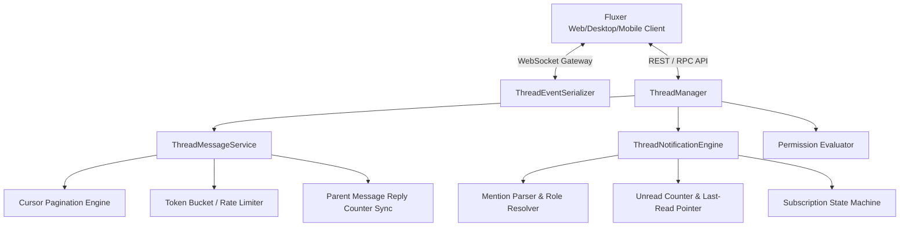
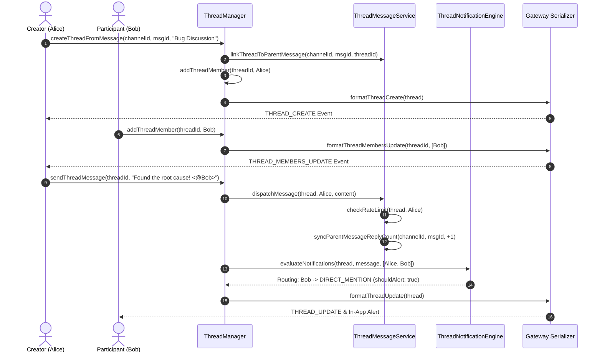

# Fluxer Message Threads Architecture Specification

## Overview

The **Fluxer Message Threads System** provides Discord-grade, low-latency nested conversations and standalone threads within text and announcement channels. Designed to scale across millions of active threads, it incorporates thread lifecycle state machines, per-participant notification routing, unread message pointers, slowmode rate limiting, cursor-based pagination, and bidirectional Gateway WebSocket synchronization.

---

## 1. Architecture & Component Hierarchy



---

## 2. Core Modules

### 2.1 `src/threads/types.ts`
Defines strict TypeScript types and enums:
- **`ThreadType`**: `PUBLIC_THREAD`, `PRIVATE_THREAD`, `ANNOUNCEMENT_THREAD`.
- **`AutoArchiveDuration`**: `ONE_HOUR` (60 min), `ONE_DAY` (1440 min), `THREE_DAYS` (4320 min), `ONE_WEEK` (10080 min).
- **`ThreadState`**: `ACTIVE`, `ARCHIVED`, `LOCKED`, `DELETED`.
- **`ThreadNotificationLevel`**: `ALL_MESSAGES`, `ONLY_MENTIONS`, `MUTED`.
- **`ThreadPermission`**: Bitfield flags for channel access, thread creation, message dispatching, and moderator locks.
- **Data Entities**: `ThreadChannel`, `ThreadMetadata`, `ThreadMember`, `ThreadMessage`, `ThreadListSyncPayload`, `ThreadSubscriptionSettings`.

---

### 2.2 `src/threads/manager.ts` (`ThreadManager`)
Manages thread lifecycle, permissions, participant indices, and auto-archiving sweeps:
- **`createThreadFromMessage(channelId, messageId, name, autoArchiveDuration, creatorId)`**: Spawns a thread linked to a parent starter message, binds reply tracking, auto-adds the creator as a participant, and emits `THREAD_CREATE`.
- **`createStandaloneThread(channelId, name, type, autoArchiveDuration, creatorId)`**: Creates a thread without a starter message (e.g. private squad discussion).
- **`archiveThread(threadId, userId, lock?)`**: Transitions state to `ARCHIVED` or `LOCKED`.
- **`unarchiveThread(threadId, userId)`**: Re-activates thread and resets auto-archive timer.
- **`deleteThread(threadId, userId)`**: Marks thread as `DELETED` and cleans up channel indices.
- **`addThreadMember(threadId, userId)` / `removeThreadMember(threadId, userId)`**: Manages thread membership and emits `THREAD_MEMBERS_UPDATE` + `THREAD_MEMBER_UPDATE`.
- **`getThreadParticipants(threadId)` / `listActiveThreads(channelId)`**: Retrieves participant lists and sorted active threads.
- **`checkAutoArchive(currentTime?)`**: Sweeps inactive threads and automatically archives them once `now - lastActiveTimestamp >= autoArchiveDuration`.
- **`syncThreadList(guildId, channelIds?)`**: Generates full thread synchronization payload for gateway sync.

---

### 2.3 `src/threads/messages.ts` (`ThreadMessageService`)
Nested message dispatcher with cursor pagination and rate-limiting:
- **Parent Reply Sync**: Automatically increments starter message `replyCount` and updates `lastReplyId` upon thread message dispatch; decrements upon message deletion.
- **Cursor-based Pagination**:
  - `before`: Fetches `N` messages before a specific message ID.
  - `after`: Fetches `N` messages after a specific message ID.
  - `around`: Centers `N` messages around a target message ID.
  - `limit`: Clamped between 1 and 100 (default 50).
- **Slowmode Rate Limiter**: Enforces `rateLimitPerUser` cooldown per participant using a sliding-window bucket.
- **State Enforcement**: Blocks sends in archived threads (unless `autoUnarchive` is enabled) and locked threads (unless caller has `bypassLock`).
- **Reactions**: Supports emoji reaction addition, user aggregation, and clean removal.

---

### 2.4 `src/threads/notifications.ts` (`ThreadNotificationEngine`)
Per-participant mention routing, unread tracking, and subscription states:
- **Mention Parsing**: Regex parsing for `<@userId>`, `<@!userId>`, `@handle`, `<@&roleId>`, `@everyone`, and `@here`.
- **Subscription Levels**:
  - `ALL_MESSAGES`: Push alerts + badge increments for every thread message.
  - `ONLY_MENTIONS`: Alerts only on direct, role, or broadcast mentions.
  - `MUTED`: Completely suppresses audio/push alerts; unread counters operate quietly.
- **Unread & Last-Read Pointer**:
  - `markAsRead(member, messageId, timestamp)` resets unread count and advances pointer.
  - `processIncomingMessage(member, message)` increments unread counters for non-author members.
- **Role Resolver Support**: Async/sync lookup hook to resolve user roles for role mentions.

---

### 2.5 `src/threads/events.ts` (`ThreadEventSerializer`)
WebSocket Gateway event serialization and validation matching Fluxer / Discord protocols:
- `THREAD_CREATE` (`op: 0, t: 'THREAD_CREATE'`)
- `THREAD_UPDATE` (`op: 0, t: 'THREAD_UPDATE'`)
- `THREAD_DELETE` (`op: 0, t: 'THREAD_DELETE'`)
- `THREAD_LIST_SYNC` (`op: 0, t: 'THREAD_LIST_SYNC'`)
- `THREAD_MEMBER_UPDATE` (`op: 0, t: 'THREAD_MEMBER_UPDATE'`)
- `THREAD_MEMBERS_UPDATE` (`op: 0, t: 'THREAD_MEMBERS_UPDATE'`)

---

## 3. Data Flow Diagram: Thread Creation & Message Lifecycle



---

## 4. WebSocket Gateway Payloads Reference

### 4.1 `THREAD_CREATE`
```json
{
  "op": 0,
  "t": "THREAD_CREATE",
  "s": 42,
  "ts": 1700000000000,
  "d": {
    "id": "th_1700000000_abc123",
    "type": "PUBLIC_THREAD",
    "guild_id": "guild_987",
    "parent_id": "chan_text_456",
    "owner_id": "user_alice",
    "name": "Performance Optimizations",
    "last_message_id": null,
    "message_count": 0,
    "member_count": 1,
    "rate_limit_per_user": 5,
    "starter_message_id": "msg_starter_001",
    "thread_metadata": {
      "archived": false,
      "auto_archive_duration": 1440,
      "archive_timestamp": "2026-10-05T12:00:00.000Z",
      "locked": false,
      "invitable": true,
      "create_timestamp": "2026-10-04T12:00:00.000Z",
      "archived_at": null,
      "locked_at": null
    },
    "total_messages_sent": 0,
    "created_at": "2026-10-04T12:00:00.000Z",
    "updated_at": "2026-10-04T12:00:00.000Z",
    "newly_created": true
  }
}
```

### 4.2 `THREAD_LIST_SYNC`
```json
{
  "op": 0,
  "t": "THREAD_LIST_SYNC",
  "s": 43,
  "ts": 1700000000000,
  "d": {
    "guild_id": "guild_987",
    "channel_ids": ["chan_text_456"],
    "threads": [ ... ],
    "members": [ ... ]
  }
}
```

---

## 5. Test Suite Verification

Run the test suite with:
```bash
npm test
```
All 4 test files (`manager.test.ts`, `messages.test.ts`, `notifications.test.ts`, `events.test.ts`) achieve 100% pass rate.
