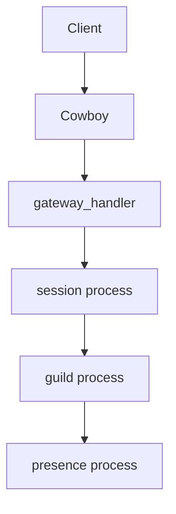

# Architecture Overview

`fluxer_gateway` is the authoritative WebSocket endpoint for the Fluxer platform. Every client connection enters through Cowboy, is handed to a `gateway_handler` process, and progresses to a per-connection Session gen_server that coordinates with Guild and Presence processes. The application is an OTP application supervised by `fluxer_gateway_sup`.

## Connection flow



## Subsystem inventory

| Subsystem | Description |
|---|---|
| WebSocket handler | `gateway_handler` and helpers — accepts connections, parses frames, enforces rate limits |
| Session management | `session` gen_server — per-connection authenticated state, event buffer, resume |
| Guild management | `guild` gen_server — per-community state, member list, permission cache, event dispatch |
| Presence | `presence` gen_server — per-user online status across all sessions and guilds |
| Push notifications | `push` gen_server and friends — APNs and FCM delivery for mobile clients |
| Voice and calls | `guild_voice_server`, `call` gen_server — LiveKit-backed voice channels and DM calls |
| NATS RPC | `gateway_nats_rpc` and pool — inter-node RPC over NATS |
| Hotpatch | `gateway_hotpatch_reconciler` and friends — live BEAM module loading without node restart |
| Telemetry | `gateway_runtime_probe`, `process_health_watchdog`, `metrics_handler` — observability and health |
| Rendezvous Router | `rendezvous_router`, `gateway_node_router` — consistent-hash key-to-node routing |

## Startup sequence

`fluxer_gateway_app:start/2` runs in order:

1. Sets `fullsweep_after` to `0` (aggressive GC).
2. Initialises JOSE for JWT and signature verification.
3. Calls `init_subsystems/0`: loads env, initialises cluster metrics, process registry, and passive sync registry.
4. Starts `fluxer_gateway_sup`.
5. Starts the Cowboy listener on the configured port with the route table below.

### Cowboy routes

| Path | Handler | Purpose |
|---|---|---|
| `/_health` | `health_handler` | Liveness probe |
| `/_health/ready` | `health_handler` | Readiness probe |
| `/_health/drain` | `health_handler` | Cluster drain trigger |
| `/_metrics` | `metrics_handler` | Prometheus scrape endpoint |
| `/` | `gateway_handler` | WebSocket upgrade |

## `GATEWAY_ROLE` environment variable

`GATEWAY_ROLE` (read via `fluxer_gateway_env:get(gateway_role)`) controls which subsystem processes the supervisor starts. An unknown or missing value defaults to `all`.

| Value | Subsystems started |
|---|---|
| `all` | Every subsystem |
| `websocket` | WebSocket handler only (no session, guild, presence, push, or call processes) |
| `sessions` | `session_state_transfer`, `session_manager` |
| `presence` | `presence_cache`, `presence_manager` |
| `guilds` | `guild_counts_cache`, `guild_manager`, `voice_state_counts_sync` |
| `calls` | `call_manager` (plus `voice_state_counts_sync` when `guilds` role is not also active) |
| `push` | `push_dispatcher`, `push` |

`presence_bus` is started whenever `presence` or `guilds` is enabled (either role or `all`).

`gateway_cluster_handoff` is started when clustering is enabled and at least one of `sessions`, `presence`, `guilds`, `calls`, or `push` is active.

The common children (`gateway_http_client`, `guild_ets_owner`, `gateway_nats_rpc`, `gateway_nats_pool`, `gateway_event_pause`, `gateway_concurrency`, `gateway_rollout_config`, `gateway_hotpatch_reconciler`, `gateway_dispatch_relay`, `gateway_periodic_gc`, `process_health_watchdog`) start regardless of role.

## Sharding model

Sharding is used to horizontally scale sessions across bot connections and large deployments.

### Client-side shard declaration

On Identify (opcode 2), a client may send a `shard` field containing a two-element array `[shard_id, num_shards]`. `gateway_sharding:parse_identify_shard/1` parses and validates this tuple. Constraints enforced:

- `shard_id` must be `>= 0` and `< num_shards`.
- `num_shards` must be `> 0` and `<= 16 384`.

If no shard is provided (`undefined` or `null`) the session is treated as unsharded and all guilds are retained.

### Guild-to-shard routing

A guild belongs to shard `shard_id` when:

```
(guild_id bsr 22) rem num_shards =:= shard_id
```

`gateway_sharding:retain_guild_ids_for_shard/2` applies this predicate to filter a list of guild IDs down to those owned by the session's shard. `gateway_sharding:guild_matches_shard/2` implements the single-guild check.

### Limits

| Limit | Value |
|---|---|
| Maximum guilds per shard | 2 500 |
| Maximum shard count | 16 384 |

When a session's filtered guild count exceeds 2 500, `validate_session_guild_count/2` returns `{error, sharding_required}` and the connection is closed with close code `4011` (`sharding_required`).

## Node routing

`gateway_node_router` maps any key (guild ID, user ID, etc.) to an owner node using the Rendezvous Router. `owner_node_result/2` accepts a key and a role, looks up `active_nodes/1` for that role from the `{gateway_cluster_membership, members_by_role}` persistent term, then calls `rendezvous_router:select_node/2`. If no nodes are active for the requested role and the current node carries that role, it falls back to `node()`.

`is_ready/0` returns `true` only when the node is not draining (`is_draining/0` checks `{fluxer_gateway, draining}` in persistent term) and `gateway_hotpatch_reconciler:is_ready()` is true. This gate blocks session acceptance until hotpatches have been applied.
