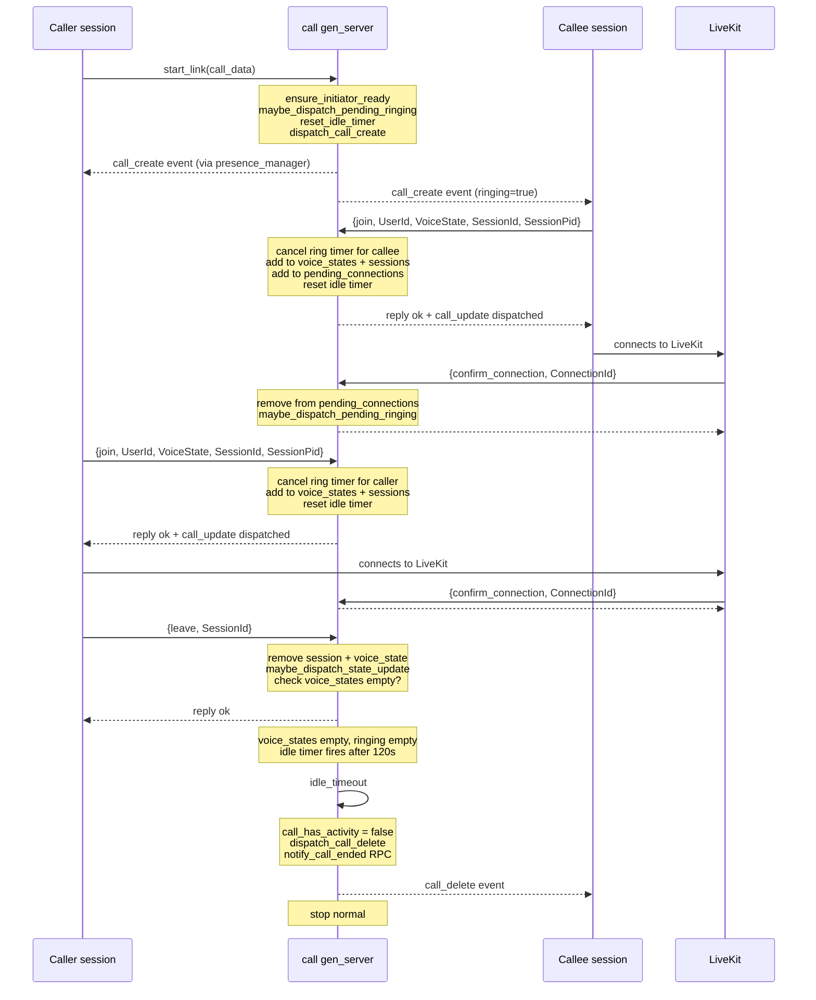

# Calls

The calls subsystem manages DM voice calls: ringing participants, tracking voice state, confirming LiveKit connections, and terminating idle calls. Each active call is a `call` gen_server process started by `call_manager`. DM voice calls differ from guild voice channels — they route through `call_manager` rather than a `guild` process. See [voice.md](voice.md) for guild voice; see [session-lifecycle.md](session-lifecycle.md) for the session-side `calls` field.

## gen_server state

`call.erl` defines the state as a plain map. The fields populated in `build_initial_state/1` are:

| Field | Type | Description |
|---|---|---|
| `channel_id` | `integer()` | DM channel this call belongs to |
| `message_id` | `integer()` | Message that initiated the call |
| `region` | `binary() \| undefined` | Preferred LiveKit region (`<<"automatic">>` maps to `null` in RPC) |
| `ringing` | `[integer()]` | User IDs currently ringing (timer active) |
| `pending_ringing` | `[integer()]` | User IDs queued to ring but not yet started |
| `recipients` | `[integer()]` | All channel members eligible to receive call events |
| `voice_states` | `#{integer() => map()}` | Per-user voice state maps keyed by user ID |
| `sessions` | `#{binary() => {integer(), pid(), reference()}}` | Session ID to `{UserId, SessionPid, MonitorRef}` |
| `pending_connections` | `map()` | Connection ID to pending-connection metadata |
| `ringing_timers` | `#{integer() => reference()}` | User ID to `erlang:send_after` reference |
| `idle_timer` | `reference() \| undefined` | Timer reference for idle-timeout check |
| `initiator_ready` | `boolean()` | Whether the initiating session is ready to receive ringing dispatches |
| `created_at` | `integer()` | Millisecond timestamp of call creation |
| `participants_history` | `sets:set()` | Set of all user IDs that ever joined (used in `call_ended` RPC) |
| `last_call_event` | `map() \| undefined` | Most recently dispatched call event payload; deduplicates `call_update` dispatches |

## Init pipeline

`init/1` has two paths. For a normal start with `call_data()`, `build_initial_state/1` sets `ringing => []` and moves the `ringing` list from the incoming data into `pending_ringing`, then `run_init_pipeline/1` executes four steps in order:

1. `call_ringing:ensure_initiator_ready/1` — sets `initiator_ready => true`.
2. `call_ringing:maybe_dispatch_pending_ringing/2` with `DispatchUpdates = false` — moves users from `pending_ringing` into `ringing`, starts a 30-second ring timer per user (via `erlang:send_after(?RING_TIMEOUT_MS, self(), {ring_timeout, UserId})`), but suppresses the `call_update` dispatch at this stage.
3. `call_ringing:reset_idle_timer/1` — cancels any existing idle timer, starts a new 120-second `erlang:send_after(?IDLE_TIMEOUT_MS, self(), idle_timeout)`.
4. `call_ringing:dispatch_call_create/1` — builds the call event via `call_state:build_call_event/1` and dispatches `call_create` to all recipients via `presence_manager:dispatch_to_user/3` (spawned in a separate process).

After `dispatch_call_create`, if `maybe_dispatch_pending_ringing` added ringing users and set `Dispatched = false`, a `call_update` is sent to push the populated `ringing` list to recipients.

For the `{transferred, State}` init path (cluster handoff), `call_handoff:restore_state/1` rebuilds the state instead, re-establishes monitors, restarts ringing and pending-connection timers, and calls `reset_idle_timer`. See [Cluster handoff](#cluster-handoff) below.

After both paths, `voice_reconciliation_v3:schedule_tick(voice_reconcile_v3_tick)` is called and a full GC runs.

## Ringing lifecycle

`call_ringing` owns all ringing state transitions.

### Starting timers

`start_ringing_timers/2` iterates a list of user IDs. For each user not already in `ringing_timers`, it calls `erlang:send_after(30000, self(), {ring_timeout, UserId})` and stores the returned reference in `ringing_timers`.

### Ring timeout

When the 30-second timer fires, `handle_info({ring_timeout, UserId}, State)` dispatches to `call_ringing:handle_ring_timeout/2`:

1. Cancels the timer entry via `cancel_ringing_timers/2`.
2. Removes the user from both `ringing` and `pending_ringing` via `remove_users_from_ringing/2`.
3. Calls `maybe_dispatch_state_update/2` which dispatches a `call_update` if `ringing` changed.
4. Calls `maybe_stop_if_empty/1` — if both `voice_states` and `ringing` are empty, dispatches `call_delete` and stops the gen_server with `{stop, normal, State}`.

### Stopping ringing explicitly

The `{stop_ringing, Recipients}` call request (handled by `handle_stop_ringing/2`) cancels timers for the listed users, removes them from `ringing` and `pending_ringing`, and dispatches a `call_update` if the ringing list changed.

### Pending ringing

`maybe_dispatch_pending_ringing/2` is the single point that promotes `pending_ringing` entries into active `ringing`. It only proceeds when `initiator_ready = true`. Users already in `voice_states` or already in `ringing` are excluded. The transition starts ring timers for the newly added users.

`pending_ringing` is populated either from the initial `call_data.ringing` list or via the `{ring_recipients, Recipients}` call request, which adds users not yet in `voice_states` to `pending_ringing` then calls `maybe_dispatch_pending_ringing`.

## `join` vs `join_async`

Two paths exist for a user entering a call:

**`{join, UserId, VoiceState, SessionId, SessionPid}` (synchronous call)**
Handled by `handle_join_request/6`, which deduplicates re-joins from the same `{UserId, SessionPid}` pair, then delegates to `call_voice:handle_join_internal/6`. The function:
- Cancels ring timers and removes the user from ringing.
- Adds the voice state to `voice_states` and monitors the session PID.
- If a `ConnectionId` is provided, adds a pending-connection entry with a 30-second `{pending_connection_timeout, ConnectionId}` timer.
- Adds the user to `participants_history`.
- Resets the idle timer.
- Dispatches a `call_update` if state changed.
- Returns `{reply, ok, NewState}` synchronously.

**`{join_async, UserId, VoiceState, SessionId, SessionPid}` (cast)**
Handled by `call_voice:handle_join_async/5`. The logic mirrors `handle_join_internal` but does not accept a `ConnectionId` and returns `{noreply, ...}` immediately. The join result is sent directly to the session process as `{call_join_result, ChannelId, {ok, FinalState}}`.

The async path is used when the call gen_server needs to avoid blocking the caller. The session receives its result out-of-band rather than as a gen_server reply.

## `confirm_connection` flow

`{confirm_connection, ConnectionId}` is a synchronous call sent by LiveKit confirmation (via NATS RPC). `handle_confirm_connection/2`:

1. Calls `ensure_initiator_ready/1` to set `initiator_ready = true` if it was still false.
2. Looks up `ConnectionId` in `pending_connections` via `voice_pending_common:confirm_pending_connection/2`.
3. If not found (already confirmed or expired): calls `maybe_dispatch_pending_ringing` and replies `#{success => true, already_confirmed => true}`.
4. If found: removes it from `pending_connections`, calls `maybe_dispatch_pending_ringing` (which may promote queued ringers now that the initiator is confirmed ready), and replies `#{success => true}`.

The `confirm_connection` call is also the trigger that unblocks any pending ringing. If the initiator had not yet been confirmed ready when `join` was called, ringing users remained in `pending_ringing`. Confirming the connection sets `initiator_ready = true` and `maybe_dispatch_pending_ringing` moves them into active ringing.

### Pending-connection timeout

Each pending connection gets a `{pending_connection_timeout, ConnectionId}` info message after 30 seconds. `handle_pending_timeout/2` checks whether the associated session is still alive via `process_liveness:is_alive/1`. If alive, the pending entry is silently removed (the connection is presumed confirmed). If the session is dead, `call_voice:disconnect_user_after_pending_timeout/4` cleans up voice state and session entries.

## Idle timeout

The idle timer fires as `idle_timeout` info message after 120 seconds of inactivity. `call_ringing:handle_idle_timeout/1` checks `call_has_activity/1`:

- `call_has_activity` returns `true` if `maps:size(voice_states) > 0` or `ringing =/= []`.
- If activity is detected, the idle timer is reset and the gen_server continues.
- If no activity is detected, `dispatch_call_delete/1` is called (which sends `call_delete` to all recipients, cancels all ringing timers, and fires a `call_ended` RPC via `rpc_client:call/1` in a spawned process), then `{stop, normal, State}` terminates the gen_server.

Idle timeout is also the path taken by `maybe_stop_if_empty/1` after a ring timeout removes the last ringing user when no one is in voice.

## Session process monitoring

Each `join` call sets up `monitor(process, SessionPid)`. When a monitored session exits, `handle_info({'DOWN', ...})` dispatches to `call_voice:handle_session_down/2`, which removes the session and cleans up the user's voice state if no remaining sessions belong to that user. If the call becomes empty after the session exits, `maybe_stop_or_noreply` terminates it.

## Voice reconciliation

`voice_reconcile_v3_tick` info messages trigger `maybe_reconcile_voice_v3/1`, which calls `voice_reconciliation_v3:find_absent_call_entries/1` to detect connections that have no live process. Absent entries are removed via `call_voice:reconcile_absent_connections/2`. The reconcile tick is rescheduled on every receipt. Reconciliation is skipped when `voice_states` is empty or when `voice_reconciliation_v3:enabled_for(call, ChannelId)` returns false.

## DM voice and the `dm_voice` module

`dm_voice.erl` is the session-side entry point for DM voice state updates. When a session processes opcode 4 (`voice_state_update`) for a DM channel, it calls `dm_voice:voice_state_update/2`.

- If `channel_id` is `null`, `dm_voice_state:handle_dm_disconnect/4` is called.
- If `channel_id` is set, `dm_voice:handle_connect/4` fetches the DM channel via `dm_voice_ring:fetch_dm_channel_via_rpc/2` and delegates to `dm_voice_connect:handle_dm_voice_with_channel/5`.
- `dm_voice:join_or_create_call/5,6` delegates to `dm_voice_token:join_or_create_call/5,6`, which either joins an existing `call` gen_server or creates a new one via `call_manager`.

This contrasts with guild voice, where opcode 4 routes through the guild gen_server to `guild_voice_server`. DM calls have no guild process; the `call` gen_server is the sole authority.

The session state holds a `calls` field (a map of channel ID to call metadata) populated by `dm_voice_connect` when a join succeeds. See [session-lifecycle.md](session-lifecycle.md) for session state.

## Cluster handoff

`call_handoff:export_state/1` serializes call state for transfer to another node:
- Only live sessions (where `process_liveness:is_alive(SessionPid)` is true) are included.
- `participants_history` (a `sets:set()`) is serialized as a plain list via `maps:keys/1` on the internal set representation.
- Timer references (`ringing_timers`, `idle_timer`) are not exported; they are recreated on the receiving node.

`call_handoff:restore_state/1` rebuilds state on the receiving node:
- Re-establishes monitors for live sessions.
- Filters `voice_states` to only include users with a live session.
- Calls `start_ringing_timers` for users still in `ringing`.
- Calls `restart_pending_connection_timers` for each entry in `pending_connections`, using elapsed time from `joined_at` to compute the remaining timeout (clamped to 0).
- Calls `reset_idle_timer` to start a fresh idle countdown.
- Calls `sync_voice_state_count_diff` to register the restored voice states in the `voice_state_counts_cache`.

The gen_server is started via `call:start_link_from_state/1` with the `{transferred, State}` init tuple.

## Sequence diagram

## Termination

`terminate/2` handles three cases:

- `{shutdown, handoff}` or `handoff` — state is being transferred; no cleanup needed.
- `normal` — orderly shutdown (idle timeout or all participants left); cleans up `voice_state_counts` for all voice states.
- Any other reason — dispatches `call_delete` via `safe_dispatch_call_delete/1` (wrapped in a try/catch) and cleans up voice state counts.
