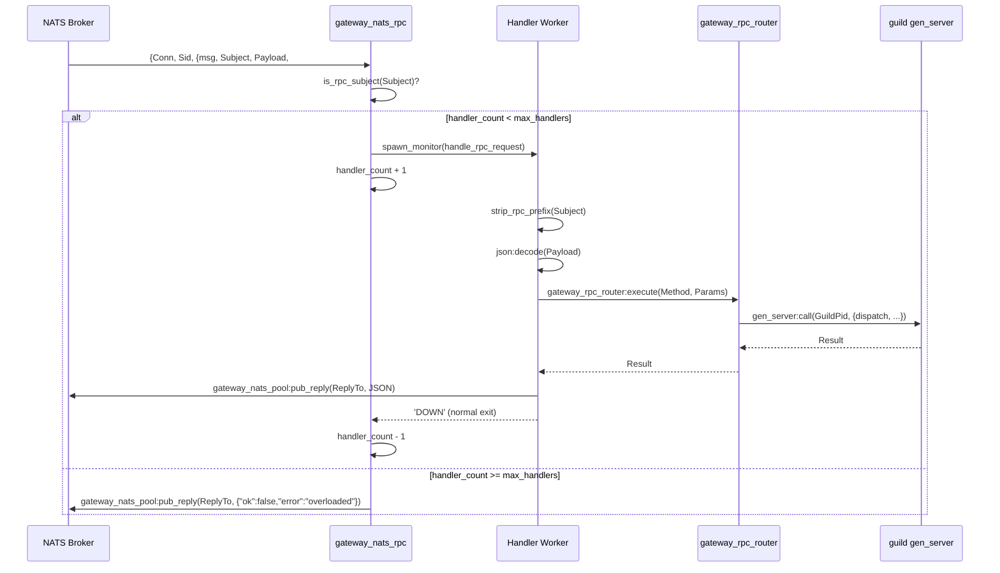

# Clustering and NATS RPC

The clustering layer gives the gateway a coherent view of which nodes are alive and which roles they serve. The NATS RPC layer routes inbound calls from external services and other gateway nodes to the correct OTP process on the correct node. Together they make it possible to deploy gateway nodes with separate roles (see [architecture-overview.md](architecture-overview.md)) and roll them out or drain them without dropping in-flight requests.

---

## Node discovery: `gateway_cluster_discovery`

`gateway_cluster_discovery` is a `gen_server` that periodically resolves the cluster peer list and publishes it to subscribers. It supports two resolution strategies, selected at startup:

- **Static peers** — `cluster_static_peers` env var; list of node atoms. Self is always filtered out.
- **DNS A-record** — `cluster_discovery_dns_name` env var; resolved via `inet:getaddrs/2` with an `inet_res` fallback. Each returned IPv4 address is combined with `cluster_discovery_node_basename` (default `fluxer_gateway`) to form a node atom `fluxer_gateway@<ip>`.

The resolved peer list is stored in `persistent_term` under `{gateway_cluster_discovery, peers}` and broadcast as `{cluster_peers_changed, Peers}` to every subscribed process. If the DNS response is empty but there were previous peers, the old list is retained and a metric is recorded. `gateway_cluster_membership` subscribes to this process at startup and re-subscribes every 10 s to survive restarts.

Polling interval defaults to 5 000 ms, configurable via `cluster_discovery_poll_interval_ms`. The server resubscribes itself at `?DISCOVERY_RESUBSCRIBE_MS` = 10 000 ms. The cap on discovered peers is 512.

---

## Membership tracking: `gateway_cluster_membership`

`gateway_cluster_membership` converts a peer list into a live membership set and, critically, maps each node to its role. It is the authoritative source that `gateway_node_router` reads.

**Persistent terms written**:

| Key | Type | Content |
|---|---|---|
| `{gateway_cluster_membership, members}` | `[node()]` | All live cluster members including self |
| `{gateway_cluster_membership, members_by_role}` | `#{atom() => [node()]}` | Live members grouped by their `GATEWAY_ROLE` |

**Lifecycle**:

1. `init/1` starts with `[node()]` as the sole member, subscribes to `gateway_cluster_discovery` and calls `net_kernel:monitor_nodes/1` to receive `nodeup`/`nodedown` notifications.
2. `{cluster_peers_changed, Peers}` triggers `apply_discovered/2`, which calls `net_kernel:connect_node/1` on each unknown peer and reconciles the connected-node list.
3. `{nodeup, Node}` adds the node only if it was already in the `discovered` set; otherwise it triggers a `gateway_cluster_discovery:force_refresh/0` in a spawned process to avoid blocking.
4. `{nodedown, Node}` removes the node from the members list immediately.
5. A `refresh_roles` timer fires every 10 000 ms. It spawns one short-lived worker per member node, calls `rpc:call(Node, fluxer_gateway_sup, current_role, [], 1000)`, and collects results within 1 100 ms. Nodes that do not respond in time retain their previously known role. The updated `members_by_role` map is written to `persistent_term`.
6. A `reconcile_nodes` timer fires every 30 000 ms to catch any nodes that connected but whose `nodeup` was missed.

Role validity is checked with `valid_role/1`, which accepts: `websocket`, `sessions`, `presence`, `guilds`, `calls`, `push`, `all`. Any other value is treated as `unknown` and excluded from the role map.

---

## Consistent hashing: `rendezvous_router`

`rendezvous_router` implements rendezvous (highest-random-weight) hashing to map an arbitrary key to one node in a candidate list. No external state is needed: the algorithm is a pure function of the key and the node list.

**Weight function**:

```erlang
node_weight(Key, Node) ->
    erlang:phash2({Key, Node}, 16#FFFFFFFF).
```

For each candidate node the weight is computed as `erlang:phash2({Key, Node}, 16#FFFFFFFF)`. The node with the highest weight wins. Ties are broken by lexicographic node name comparison (`Node < BestNode`), making the result deterministic regardless of the order in which nodes appear in the list.

**Key property**: when a node leaves, only keys that were assigned to that departing node are redistributed. Keys already owned by the remaining nodes do not move. This is verified by `select_node_minimal_disruption_on_leave_test/0`.

A second variant, `select/2`, maps a key to a shard index (non-negative integer) using the same algorithm and is used by sharded ETS pools (presence bus, push eligibility cache — see [presence-subsystem.md](presence-subsystem.md) and [push-notifications.md](push-notifications.md)).

`group_keys/2` groups a list of keys by their selected shard index, producing sorted `[{Index, [Key]}]` pairs, used for batching cross-shard work.

---

## Node routing: `gateway_node_router`

`gateway_node_router` is the call site other subsystems use to determine which node owns a key for a given role. It reads exclusively from `persistent_term` and calls into `rendezvous_router`.

### `owner_node_result/2`

```erlang
owner_node_result(Key, Role) ->
    case active_nodes(Role) of
        [] -> fallback_owner_for_role(Role);
        Nodes -> {ok, select_owner_node(Key, Nodes)}
    end.
```

- `active_nodes(Role)` reads `{gateway_cluster_membership, members_by_role}` and merges the role-specific node list with the `all` (monolith) node list, then intersects with the full `members` list to drop stale entries.
- When the role map is absent (e.g. single-node deployment with no cluster), it falls back to `fluxer_gateway_sup:role_enabled(Role)`: returns `{ok, node()}` if the current node serves that role, or `{error, {no_active_nodes, Role}}` otherwise.
- When no nodes exist for a role, `fallback_owner_for_role/1` applies the same logic.

`select_owner_node/2` normalises the key to a binary before hashing:

| Key type | Normalisation |
|---|---|
| `binary()` | used as-is |
| `integer()` | `integer_to_binary/1` |
| `atom()` | `atom_to_binary(_, utf8)` |
| other | `term_to_binary/1` |

The candidate list is sorted (`lists:usort`) before passing to `rendezvous_router:select_node/2` so the result is independent of insertion order.

### Drain detection

`is_draining/0` reads `persistent_term:get({fluxer_gateway, draining}, false)`. Any truthy value means the node is draining.

`is_ready/0` returns `not is_draining() andalso gateway_hotpatch_reconciler:is_ready()`. Sessions are blocked from starting while either condition fails (see [hot-patching.md](hot-patching.md)).

---

## NATS RPC subscriber: `gateway_nats_rpc`

`gateway_nats_rpc` is a `gen_server` that owns a single NATS connection used exclusively for receiving inbound RPC calls and routing them to handler workers.

### Connection lifecycle

1. `init/1` sends itself a `connect` message immediately.
2. `connect` triggers `gateway_nats_rpc_handler:do_connect/1`, which reads `nats_core_url` and `nats_auth_token` from env, spawns an async connect worker, and sets a `?CONNECT_TIMEOUT_MS` = 10 000 ms watchdog timer keyed by a unique `Token` reference.
3. On success the connect worker sends `{nats_connect_result, Pid, {ok, Conn}}`. The token is validated to reject stale results. `nats:monitor/1` is called on the new connection.
4. The NATS library sends `{Conn, ready}` once the connection is usable. `gateway_nats_rpc_handler:do_subscribe/1` subscribes to the subjects for the current role.
5. On `{Conn, closed}` or `{Conn, {error, _}}` the connection is torn down and `schedule_reconnect/1` sends a `connect` message after `?RECONNECT_DELAY_MS` = 2 000 ms.
6. If the connection process dies (`'DOWN'` on the monitor), the same reconnect path is taken.

`enable_rpc_subscription/0` and `disable_rpc_subscription/0` are called by `gateway_cluster_handoff` to stop accepting new RPC calls during drain. Both also mirror the operation to `gateway_nats_pool`.

### RPC subscription subjects

Subjects are determined by `gateway_nats_rpc_handler:rpc_subjects_for_role/1`:

| Role | Subscribed subjects |
|---|---|
| `all` | `rpc.gateway.>` |
| `guilds` | `rpc.gateway.guild.>`, `rpc.gateway.voice.>`, `rpc.gateway.process.>` |
| `presence` | `rpc.gateway.presence.>` |
| `calls` | `rpc.gateway.call.>`, `rpc.gateway.voice.>` |
| `push` | `rpc.gateway.push.>` |
| `websocket` | *(none)* |
| `sessions` | *(none)* |

All subscriptions use queue group `gateway`, so only one node in the group receives each message.

### Handler worker pool and overload backpressure

When a message arrives on an RPC subject:

1. `gateway_nats_rpc_handler:is_rpc_subject/1` distinguishes RPC subjects (prefix `rpc.gateway.`) from rollout config subjects. Non-RPC messages are forwarded to the `gateway_rollout_config` process.
2. If the message has no `reply_to` it is dropped silently.
3. If `handler_count >= max_handlers`, `gateway_nats_rpc` replies immediately with `{"ok": false, "error": "overloaded"}` via `gateway_nats_pool:pub_reply/2` without spawning a handler.
4. Otherwise a handler worker is spawned via `spawn_monitor`. `handler_count` is incremented and the monitor reference is tracked in `handler_refs`.
5. When the handler process exits (normally or abnormally) the `'DOWN'` message decrements `handler_count` and removes the reference.

`max_handlers` defaults to 1 024 and is configurable via `gateway_http_rpc_max_concurrency`.

---

## Publish pool: `gateway_nats_pool`

`gateway_nats_pool` is a `gen_server` that manages a pool of NATS connections optimised for outbound publishing. The pool size is read from `gateway_nats_pool_conn:pool_size/0` at startup.

Connection references are stored in a tuple in `persistent_term` under `{gateway_nats_pool, connections}`. `gateway_nats_pool_conn:get_pool_conn/0` reads that tuple directly, bypassing the gen_server for zero-copy fast-path publishing.

Each slot connects independently. Slots that fail to connect schedule a reconnect via `gateway_nats_pool_conn:schedule_reconnect/2`. The gen_server tracks `slots` (index → conn), `monitors` (monitor ref → slot index), and `connecting` (index → connect entry with pid and token) to correctly handle stale connect results.

`pub_reply/2` publishes to a subject and records a failure counter in `persistent_term` if the publish fails. The failure counter is created lazily and uses `counters:new/2` with `write_concurrency` to avoid contention.

Like `gateway_nats_rpc`, the pool also accepts inbound RPC messages on its connections when `rpc_enabled` is true, providing additional throughput capacity for inbound calls. The same `handler_count`/`max_handlers` guard applies; overloaded responses use `send_overloaded/1` which calls `gateway_nats_pool:pub_reply/2`.

---

## RPC handler: `gateway_nats_rpc_handler`

Each handler worker calls `gateway_nats_rpc_handler:handle_rpc_request/3`:

1. The `rpc.gateway.` prefix is stripped from the subject, yielding the method path (e.g. `guild.dispatch`).
2. The JSON payload is decoded.
3. `gateway_rpc_router:execute(Method, Params)` is called. This synchronously routes to the relevant gen_server (guild, presence, push, call, etc.).
4. The result is wrapped in `guild_data_wire:payload/1`, encoded to JSON, and published to `reply_to` via `gateway_nats_pool:pub_reply/2`.

Error handling:

| Exception | Response |
|---|---|
| `{gateway_rpc_error, Msg}` or `throw:{error, Msg}` | `{"ok": false, "error": "<msg>"}` |
| `exit:timeout` or `exit:{timeout, _}` | `{"ok": false, "error": "timeout"}` |
| Any other `Class:Reason` | `{"ok": false, "error": "internal_error"}` |

`guild_not_found` and `forbidden` errors are not logged (expected application errors). All other throw errors are logged at warning level.

---

## Inbound RPC flow



---

## Drain and handoff: `gateway_cluster_handoff`

`gateway_cluster_handoff` is started only when clustering is enabled (see [otp-supervision-tree.md](otp-supervision-tree.md)). It listens for membership changes from `gateway_cluster_membership` and coordinates session and guild transfers to peer nodes.

### Drain trigger

Drain is initiated by the `/_health/drain` HTTP endpoint (loopback-only). `gateway_cluster_handoff:drain_async/0` does three things:

1. Writes `true` to `persistent_term` key `{fluxer_gateway, draining}`. All subsequent `gateway_node_router:is_ready/0` calls return `false`, stopping new sessions from being accepted.
2. Calls `drain_notify_role/0`:
   - Role `websocket`: broadcasts `session_reconnect` to all WebSocket handler processes so clients reconnect to another node.
   - Role `all`: calls `session_manager:reconnect_drain/0` which sends the same signal through the session manager shards.
3. Casts `drain` to the `gateway_cluster_handoff` gen_server, which calls `gateway_cluster_handoff_transfer:drain_targets/1` to select target nodes and starts a handoff worker.

`undrain/0` erases the draining flag and logs a message. It is used to cancel a drain that was triggered accidentally.

### Handoff worker

`maybe_start_handoff/1` spawns a monitored worker process that calls `gateway_cluster_handoff_transfer:run_handoff/1`. The worker has a `?HANDOFF_WORKER_TIMEOUT_MS` = 30 000 ms watchdog. On completion it sends `{handoff_complete, Pid, Members, Result}` back to the gen_server.

The gen_server serialises concurrent handoff attempts: if a worker is already in flight, new topology changes set `pending_members` and are processed after the current worker finishes. On failure the pending members list is rescheduled.

A `?DEBOUNCE_MS` = 2 000 ms timer debounces rapid membership changes to avoid spawning a new worker for every node churn event. A periodic `reconcile_topology` message fires every 60 000 ms to catch any missed membership transitions.

### State transfer

`gateway_cluster_handoff_transfer` (not listed but used by handoff) handles the actual transfer protocol:
- Sessions are serialized via `session:serialize_transfer_state/1` (see [session-lifecycle.md](session-lifecycle.md)) and sent to the target node.
- Guilds export their state via `guild:export_handoff_state/0` (see [guild-gen-server.md](guild-gen-server.md)) and are reconstructed on the target.
- The target node is selected by `drain_targets/1` from the current live member list, excluding the draining node itself.

---

## Configuration reference

| Env var | Default | Description |
|---|---|---|
| `cluster_discovery_dns_name` | `undefined` | Headless DNS name to resolve for peers |
| `cluster_discovery_node_basename` | `fluxer_gateway` | Node name prefix used when building peer atoms from IPs |
| `cluster_discovery_poll_interval_ms` | `5000` | Discovery poll interval in ms |
| `cluster_static_peers` | `[]` | Static list of peer node atoms |
| `nats_core_url` | — | NATS broker URL, e.g. `nats://127.0.0.1:4222` |
| `nats_auth_token` | — | NATS authentication token |
| `nats_rpc_enabled` | `true` | Set to `false` to connect without subscribing |
| `gateway_http_rpc_max_concurrency` | `1024` | Max concurrent RPC handler workers |
