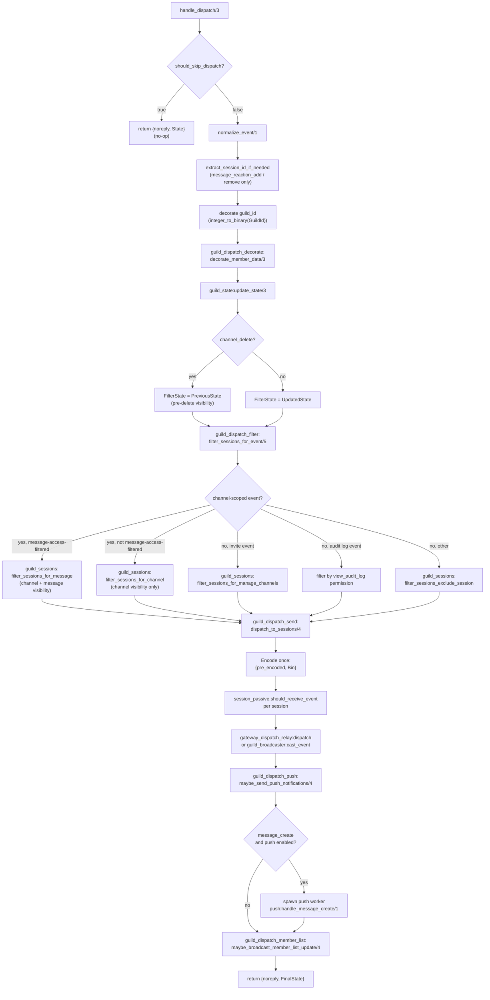

# Event Dispatch Pipeline

This document describes how an incoming event travels through the guild dispatch pipeline from the entry point in `guild_dispatch.erl` to delivery across filtered sessions. Related context: [guild-gen-server.md](guild-gen-server.md) covers how `dispatch_event/3` in the guild gen_server calls into this pipeline. [push-notifications.md](push-notifications.md) covers the push subsystem that `guild_dispatch_push` delegates to.

---

## Overview

Every event dispatched to a guild follows a fixed pipeline:

1. Guard check (`should_skip_dispatch`)
2. Session-ID extraction
3. `guild_id` decoration
4. Member data decoration
5. Guild state update
6. Filter-state selection
7. Session filtering
8. Session send
9. Push notifications
10. Member-list broadcast

The pipeline is implemented across six modules: `guild_dispatch`, `guild_dispatch_decorate`, `guild_dispatch_filter`, `guild_dispatch_send`, `guild_dispatch_push`, and `guild_dispatch_member_list`.

---

## Pipeline Flowchart



---

## Entry Point: `handle_dispatch/3`

`guild_dispatch:handle_dispatch/3` is called by the guild gen_server (see [guild-gen-server.md](guild-gen-server.md)) for every inbound event.

```erlang
handle_dispatch(Event, EventData, State) ->
    case should_skip_dispatch(Event, State) of
        true  -> {noreply, State};
        false -> process_dispatch(normalize_event(Event), EventData, State)
    end.
```

### `should_skip_dispatch/2`

Prevents delivery for guilds that are unavailable to the general user population. The guard checks the guild's `features` list in `State.data.guild.features` for either of two flags:

- `<<"UNAVAILABLE_FOR_EVERYONE">>`
- `<<"UNAVAILABLE_FOR_EVERYONE_BUT_STAFF">>`

The `guild_update` event is **exempt** from this guard regardless of features, so guild data updates still propagate. All other events are silently dropped when either flag is present.

---

## `process_dispatch/3` Steps

### Step 1 — Session-ID extraction

For `message_reaction_add` and `message_reaction_remove`, the originating session's `<<"session_id">>` is stripped from the event data. This prevents echoing the reaction back to the session that produced it. The extracted `SessionIdOpt` value (`binary() | undefined`) is threaded through filtering to exclude the source session. For all other events, `SessionIdOpt` is `undefined`.

Implementation: `guild_dispatch_decorate:extract_and_remove_session_id/1`.

### Step 2 — `guild_id` decoration

The guild's integer ID is added to the event data as a binary string:

```erlang
DecoratedData = CleanData#{<<"guild_id">> => integer_to_binary(GuildId)}
```

### Step 3 — Member data decoration

`guild_dispatch_decorate:decorate_member_data/3` appends a `<<"member">>` field to relevant events. It distinguishes two event categories:

**Message events** (`message_create`, `message_update`, `message_delete`, `message_delete_bulk`): looks up the author by `author.id` or `author_id`, adds a `member` field without the redundant `user` sub-key.

**User events** (`typing_start`, `message_reaction_add`, `message_reaction_remove`): looks up by `user_id`, adds a `member` field including the `user` sub-key.

Events not in either category receive no decoration.

Member lookup delegates to `guild_permissions:find_member_by_user_id/2` against the current guild state.

### Step 4 — State update

`guild_state:update_state/3` applies the event's mutations to the guild state, returning `UpdatedState`. For example, a `guild_member_update` event updates the member record held in guild data.

### Step 5 — Filter-state selection

For `channel_delete` the filter step must evaluate session visibility **before** the deletion is applied, because `update_state` already removed the channel from guild data. `filter_state_for_event/3` returns `PreviousState` (the pre-update state) when the event is `channel_delete`, so that `can_view_channel` checks still have the channel present. For all other events it returns `UpdatedState`.

This ensures only users who could see the deleted channel receive the `channel_delete` event.

### Step 6 — Session filtering

`guild_dispatch_filter:filter_sessions_for_event/5` returns the subset of sessions that should receive the event. The sessions map comes from `UpdatedState`; the visibility check uses `FilterState`.

Filtering logic branches on event type:

**Channel-scoped events** (`channel_create`, `channel_update`, `channel_delete`, `message_create`, `message_update`, `message_delete`, `message_delete_bulk`, `message_reaction_*`, `typing_start`, `channel_pins_update`, `webhooks_update`):

- The channel ID is extracted. For `channel_create/update/delete` it comes from the `<<"id">>` field; for all others from `<<"channel_id">>`.
- Events that are also *message-access-filtered* (`message_update`, `message_delete`, `message_reaction_*`) additionally check message visibility via `guild_sessions:filter_sessions_for_message`.
- All other channel-scoped events use `guild_sessions:filter_sessions_for_channel`, which calls `guild_permissions:can_view_channel/4` per session.

**Invite events** (`invite_create`, `invite_delete`): filtered to sessions that hold `MANAGE_CHANNELS` permission for the invite's channel via `guild_sessions:filter_sessions_for_manage_channels`. If the channel ID cannot be extracted, the result is an empty list.

**Audit log events** (`guild_audit_log_entry_create`): filtered to sessions whose user holds the `view_audit_log` permission bit.

**All other events**: all sessions are included except the originating session (`SessionIdOpt`), via `guild_sessions:filter_sessions_exclude_session`.

In all cases a session with `pending_connect: true` is excluded, and the originating session identified by `SessionIdOpt` is excluded from events that carry one.

### Step 7 — Send

`guild_dispatch_send:dispatch_to_sessions/4` dispatches to the filtered sessions.

**Standard events** (`is_bulk_update_event` returns false): the payload is JSON-encoded once using `guild_data_wire:payload/1` and wrapped as `{pre_encoded, Bin}`. Every eligible session receives this same binary without re-encoding. The eligibility check calls `session_passive:should_receive_event/5` per session, which handles passive-mode suppression for large guilds. Delivery uses `gateway_dispatch_relay:dispatch/4` or, when available, `guild_broadcaster:cast_event/4` for batched delivery.

**Bulk update events** (`channel_update_bulk`): each session receives a per-session payload with only the channels it can see. Channels are indexed once (`{ChannelId, Channel}` pairs), then filtered per session using the session's `viewable_channels` map if present, or falling back to `guild_permissions:can_view_channel/4`. The per-session payload is also wrapped as `{pre_encoded, Bin}`.

The `{pre_encoded, Bin}` wrapper signals to session processes that the payload is already encoded; each session forwards it to its socket without additional serialization.

### Step 8 — Push notifications

`guild_dispatch_push:maybe_send_push_notifications/4` triggers mobile push delivery. It only acts on `message_create` events and only when `disable_push_notifications` is not set on the guild state.

To avoid blocking the guild gen_server, push work is spawned in a separate process. A process dictionary entry `push_inflight` tracks the spawned process; if that process is still alive when a new `message_create` arrives, the new notification is dropped to prevent unbounded spawning.

The spawned process calls `collect_and_send_push_notifications/3`, which:

1. Checks `guild_dispatch_config:should_send_push_notifications/1` — bails out if push is disabled at config level.
2. Builds a `SessionEligibility` map: per-user boolean indicating whether all sessions for that user are in AFK state (only AFK sessions are push-eligible).
3. Builds a candidate user list: members who are sessionless, AFK-eligible, or explicitly mentioned (direct mention or role mention). On `mention_everyone`, all members are candidates.
4. Filters candidates to those who can view the message channel (`guild_permissions:can_view_channel/4`).
5. Calls `push:handle_message_create/1` with a context map containing message data, eligible user IDs, guild metadata, channel name, role names, and per-user role lists.

The `push` gen_server (documented in [push-notifications.md](push-notifications.md)) handles eligibility checks, rendezvous routing, and APNs/FCM delivery from there.

### Step 9 — Member-list broadcast

`guild_dispatch_member_list:maybe_broadcast_member_list_update/4` fires last. It first checks `guild_dispatch_config:is_member_list_updates_enabled/1`; if member list updates are disabled for this guild, it returns `UpdatedState` unchanged.

When enabled, it delegates to `guild_member_list` functions based on the event:

| Event | Action |
|---|---|
| `guild_member_add`, `guild_member_remove`, `guild_member_update` | `broadcast_member_list_updates/3` for the affected user |
| `guild_role_create`, `guild_role_update`, `guild_role_update_bulk`, `guild_role_delete` | `broadcast_all_member_list_updates/1` |
| `channel_create`, `channel_delete` | `broadcast_all_member_list_updates/1` |
| `channel_update` | `broadcast_member_list_updates_for_channel/2` for the affected channel |
| `channel_update_bulk` | `broadcast_member_list_updates_for_channel/2` for each channel in the payload |
| All other events | no-op |

For member events, the user ID is extracted from `event_data.user.id`. If extraction fails, the broadcast is skipped.

`maybe_broadcast_member_list_update/4` returns the (potentially updated) guild state, which becomes `FinalState` returned to the guild gen_server.

---

## Module Reference

| Module | Responsibility |
|---|---|
| `guild_dispatch` | Entry point, pipeline orchestration, `filter_state_for_event` |
| `guild_dispatch_decorate` | Session-ID extraction, `guild_id` and member data decoration |
| `guild_dispatch_filter` | Per-event session filtering and visibility dispatch |
| `guild_dispatch_send` | `{pre_encoded, Bin}` encoding and session delivery |
| `guild_dispatch_push` | Push spawn and push candidate selection |
| `guild_dispatch_member_list` | Member-list broadcast after state mutation |
