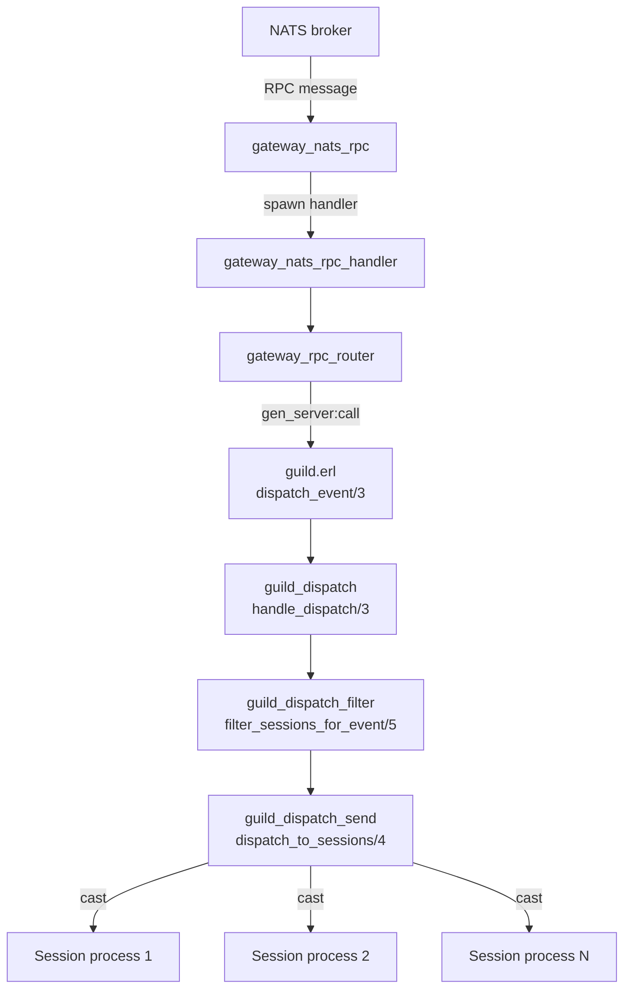

# Guild gen_server

The guild gen_server (`guild.erl`) is the authoritative in-memory state store for a single
Guild. Every live guild has exactly one such process on the cluster node that owns it, determined
by rendezvous hashing (see [clustering-nats-rpc.md](clustering-nats-rpc.md)).

The process holds guild data, the active session map, voice states, permission caches and the
member-list engine. It is the single point through which all events and queries for that guild
flow.

---

## Init pipeline

`init/1` runs five steps in strict order. Each step takes the state produced by the previous one.

```erlang
State0 = guild_init:init_base_state(GuildState),
State1 = guild_init:init_member_list(State0),
State2 = guild_init:init_counts(State1),
State3 = guild_init:init_caches_and_timers(State2),
State4 = guild_init:init_voice_server(State3),
```

A final `erlang:garbage_collect()` runs before `{ok, State4, ?HIBERNATE_TIMEOUT}` is returned,
releasing any working memory allocated during init.

### 1. `init_base_state`

Defined in `guild_init.erl`. Runs on the raw map passed at startup (which may carry transferred
sessions from a cluster handoff):

1. **Remonitor transferred sessions**: `guild_handoff:remonitor_transferred_sessions/1`
   re-establishes `erlang:monitor` links for any sessions that arrived via handoff.
2. **Extract voice states**: `extract_voice_states_from_data/2` lifts `<<"voice_states">>` out
   of the data map into a top-level `voice_states` field, normalising the list into a map keyed
   by `connection_id`. Any pre-existing voice states from the handoff are used as a fallback.
3. **Normalise data index**: `guild_data_index:normalize_data/1` builds lookup structures for
   members, roles and channels inside the data map.
4. **Create ETS tables**: three ETS tables are created and stored in state:
   - `guild_members_data`: `set`, `public`, `read_concurrency`: bulk-populated with every
     member entry from `members_normalized`.
   - `member_presence`: `set`, `public`.
   - `viewable_channels_cache`: `set`, `public`.
5. **Init subscription state**: `presence_subscriptions`, `member_list_subscriptions`,
   `member_subscriptions`, `connected_user_ids` and `user_session_counts` are all set to their
   empty initial values.
6. **Restore session state**: `guild_handoff:restore_transferred_session_state/1` applies any
   per-session data that was carried over during handoff.

### 2. `init_member_list`

Defined in `guild_init.erl`. Creates the NIF-backed member list engine:

1. `guild_member_list_store:new(GuildId)` allocates a native NIF reference.
2. Members are converted to tuples via `guild_member_list_store:prepare_member_tuples/2`.
3. Hoisted role IDs (roles marked as displayed separately in the member list) are extracted via
   `guild_member_list_store:prepare_hoisted_role_ids/2`.
4. `guild_member_list_store:bulk_load/3` bulk-loads both members and hoisted role IDs into the
   engine in a single call.
5. The NIF reference is stored under `member_list_engine` in state.

If the guild ID is not a valid positive integer the step is skipped and state is returned
unchanged.

### 3. `init_counts`

Defined in `guild_init.erl`. Derives three count fields from data:

| Field | Source |
|---|---|
| `member_count` | Carried from handoff if present and non-negative; otherwise `guild_data_index:member_count/1` |
| `online_count` | `guild_member_list:get_online_count/1` |
| `public_online_count` | `guild_public_online:compute_count/1` |

### 4. `init_caches_and_timers`

Defined in `guild_init.erl`. Writes initial cache entries and schedules recurring timers:

| Action | Function |
|---|---|
| Populate permission cache | `guild_maintenance:maybe_put_permission_cache/1` |
| Update unavailability cache | `guild_availability:update_unavailability_cache_for_state/1` |
| Populate guild count cache | `guild_maintenance:maybe_put_guild_count_cache/3` |
| Schedule passive sync | `guild_passive_sync:schedule_passive_sync/1` |
| Schedule count cache refresh | `guild_maintenance:schedule_count_cache_refresh/1` (30 000 ms interval) |
| Schedule availability recheck | `guild_availability:schedule_availability_recheck/1` |
| Schedule presence reconcile | `guild_presence_reconcile:schedule/0` |

None of the timer results are stored in state; the timers send messages back to the guild process.

### 5. `init_voice_server`

Defined in `guild_init.erl`. Starts `guild_voice_server` as a linked child:

```erlang
{ok, VoicePid} = guild_voice_server:start_link(GuildId, self(), InitialVoice),
State#{voice_server_pid => VoicePid}
```

Because it is linked, an abnormal exit from the voice server sends an `'EXIT'` signal to the
guild process, which `handle_info({'EXIT', Pid, Reason})` catches and delegates to
`guild_voice_lifecycle:handle_voice_server_exit/3`.

See [voice.md](voice.md) for the voice server internals.

---

## `handle_call` routing

Incoming calls are matched in pattern order. The first four clauses handle specific messages
directly; everything else falls through to `route_call/4`.

```
{session_connect, Request}        → handle_session_connect_call
export_handoff_state              → guild_handoff:export_handoff_state
{get_cached_voice_state_by_connection, ConnectionId}
                                  → guild_voice_lifecycle:reply_cached_voice_state
{dispatch, Request}               → handle_dispatch_call
{reload, NewData}                 → guild_init:handle_reload
get_voice_server_pid              → guild_voice_lifecycle:reply_voice_server_pid
{terminate}                       → {stop, normal, ok, State}
Any other tuple                   → route_call/4
```

`route_call/4` extracts the first element of the tuple as a `Tag` atom and calls
`call_handler/1`, which chains through three classifier functions:

| Tag matches | Handler module |
|---|---|
| `get_counts`, `get_user_counts`, `get_channel_member_counts`, `get_large_guild_metadata`, `resolve_*`, `search_guild_members`, `list_guild_members*`, `get_guild_member`, `get_guild_members_batch`, `has_member`, `get_*`, `check_*`, `can_*` | `guild_query_handler` |
| `voice_state_update`, `get_voice_state`, `update_member_voice`, `disconnect_*`, `confirm_voice_connection_from_livekit`, `move_member`, `switch_voice_region`, `add_virtual_channel_access`, `store_pending_connection`, `get_voice_states_for_channel`, `get_pending_joins_for_channel` | `guild_voice_handler` |
| `lazy_subscribe` | `guild_subscription_handler` |

An unrecognised tag returns `{reply, ok, State}` without modifying state.

---

## Session connect: sync vs async

### Synchronous path: `{session_connect, Request}`

`handle_call({session_connect, Request}, {CallerPid, _}, State)` calls
`guild_sessions:handle_session_connect/3` directly and blocks until it returns. The session PID
is taken from `Request.session_pid` if present; otherwise it defaults to `CallerPid`.

`guild_sessions:handle_session_connect/3` delegates to `guild_sessions_connect` and can return:

- `{reply, {ok, map()}, State}`: connected successfully.
- `{reply, {ok, unavailable, map()}, State}`: guild is unavailable to this session.
- `{reply, {error, too_many_sessions}, State}`: session cap reached.
- `{reply, {error, not_member}, State}`: caller is not a guild member.

### Asynchronous path: `{session_connect_async, ...}`

For large guilds or high-concurrency scenarios the session process sends a cast instead:

```erlang
handle_cast({session_connect_async,
    #{guild_id := GuildId, attempt := Attempt, request := Request}}, State)
```

`guild_connect_async:enqueue_session_connect_async/4` queues the request and spawns a monitored
worker process to compute the heavy `GUILD_CREATE` payload off the guild gen_server's mailbox.
The worker replies via:

```erlang
handle_cast({session_connect_worker_done, SessionId, Attempt, Result, Computed}, State)
```

`guild_connect_async:finalize_session_connect_async/5` then merges the computed state back into
the guild and sends the result to the waiting session.

Worker process failures are handled in `handle_down/2`: the reference is removed from
`session_connect_worker_refs` and, for abnormal exits, `guild_connect_async` decrements the
in-flight counter and may start more waiting workers.

---

## `dispatch_event/3`

All event dispatch, whether from a synchronous `{dispatch, Request}` call or an async
`{dispatch, Request}` cast, passes through the same internal function:

```erlang
dispatch_event(Event, EventData, State) ->
    {noreply, NewState} = guild_dispatch:handle_dispatch(Event, parse_event_data(EventData), State),
    StateAfterPrune = guild_maintenance:maybe_prune_invalid_member_subscriptions(Event, NewState),
    ok = maybe_refresh_permission_cache(Event, StateAfterPrune),
    StateAfterPrune.
```

Three sequential operations:

1. **State update and session fan-out**: `guild_dispatch:handle_dispatch/3` applies the event
   to guild state and sends it to all eligible sessions. See [event-dispatch-pipeline.md](event-dispatch-pipeline.md) for the full pipeline.

2. **Prune stale member subscriptions**: `guild_maintenance:maybe_prune_invalid_member_subscriptions/2` runs when the event is one of:
   `guild_member_remove`, `guild_member_update`, `guild_role_update`, `guild_role_update_bulk`,
   `guild_role_delete`, `channel_update`, `channel_update_bulk`, `channel_delete`. It iterates
   `member_subscriptions` and removes any subscriber sessions that can no longer share a viewable
   channel with the subscribed member.

3. **Permission cache refresh**: `maybe_refresh_permission_cache/2` calls
   `guild_maintenance:maybe_put_permission_cache/1` when `event_mutates_guild_data/1` returns
   `true` for the event.

### `event_mutates_guild_data/1`

Returns `true` for the following events, triggering a permission cache refresh after dispatch:

```
guild_member_add        guild_member_update     guild_member_remove
guild_role_create       guild_role_update       guild_role_update_bulk
guild_role_delete       channel_create          channel_update
channel_update_bulk     channel_delete          guild_update
```

Any other event returns `false` and no cache refresh occurs.

---

## Data flow diagram



---

## Hibernate timeout

```erlang
-define(HIBERNATE_TIMEOUT, 60000).
```

Every successful `handle_call` and `handle_cast` response that returns a plain
`{reply, ..., State}` or `{noreply, State}` is paired with `?HIBERNATE_TIMEOUT` at init time
only. For quiet guilds the process eventually receives a `timeout` message:

```erlang
handle_info(timeout, State) ->
    {noreply, State, hibernate};
```

Hibernating calls `erlang:hibernate/3`, which compacts the process heap to its minimum and
suspends the process until the next message arrives. This reduces resident memory significantly
for guilds with low traffic. The next message resumes the process normally.

---

## Guild termination

`terminate/2` runs cleanup in six guarded steps. Each step is wrapped in `safe_cleanup/2` so a
failure in one step does not abort the others:

| Step | What happens |
|---|---|
| `presence_unsubscribe` | Iterates `presence_subscriptions` and calls `presence_bus:unsubscribe/1` for each user ID |
| `permission_cache_delete` | `guild_maintenance:maybe_delete_permission_cache/2` deletes the ETS entry for this guild from `guild_permission_cache` |
| `ets_cleanup` | Deletes the three per-guild ETS tables: `guild_members_data` (via `data.members_ets`), `member_presence` and `viewable_channels_cache` |
| `voice_cleanup` | If `voice_server_pid` is alive, calls `gen_server:stop/3` with a 5 000 ms timeout |
| `member_list_subs_cleanup` | `guild_member_list_subs:destroy/1` destroys the member list subscription table |
| `member_list_engine_cleanup` | `guild_member_list_channel_engine:destroy_all/1` then `guild_member_list_engine:destroy/1` release the NIF-backed engine |

Normal (`normal`, `shutdown`, `{shutdown, _}`) and abnormal termination both run the same
cleanup; `maybe_report_crash/2` is a no-op for all reason values as of this writing.

---

## Key state fields

| Field | Type | Description |
|---|---|---|
| `id` | `integer()` | Guild ID (Snowflake) |
| `data` | `map()` | Normalised guild data; contains `members_ets`, `roles`, `channels`, `guild`, `members_normalized` |
| `sessions` | `map()` | Session ID → session entry map |
| `voice_states` | `map()` | Connection ID → voice state map |
| `voice_server_pid` | `pid()` | Linked `guild_voice_server` process |
| `presence_subscriptions` | `map()` | User ID → subscription count; tracks `presence_bus` subscriptions |
| `member_list_subscriptions` | opaque | NIF-backed member list subscription table |
| `member_list_engine` | `reference()` | NIF reference for the member list engine |
| `member_subscriptions` | `map()` | Member user ID → set of subscriber session IDs |
| `member_count` | `integer()` | Total member count |
| `online_count` | `integer()` | Currently online members |
| `public_online_count` | `integer()` | Publicly visible online count |
| `member_presence` | `ets:table()` | Per-user presence ETS table |
| `viewable_channels_cache` | `ets:table()` | Per-user viewable channel ETS table |
| `session_connect_worker_refs` | `map()` | Monitor reference → in-flight async connect worker |

---

## Related documents

- [session-lifecycle.md](session-lifecycle.md): how sessions attach to and detach from the guild.
- [event-dispatch-pipeline.md](event-dispatch-pipeline.md): the full dispatch pipeline inside `guild_dispatch`.
- [voice.md](voice.md): `guild_voice_server` internals and the voice connection lifecycle.
- [permissions.md](permissions.md): permission cache structure and invalidation.
- [clustering-nats-rpc.md](clustering-nats-rpc.md): how NATS RPC routes calls to the guild gen_server.
