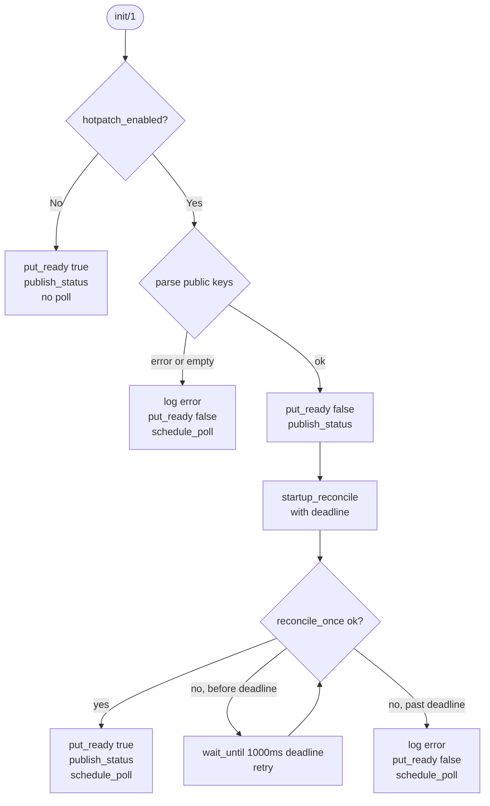
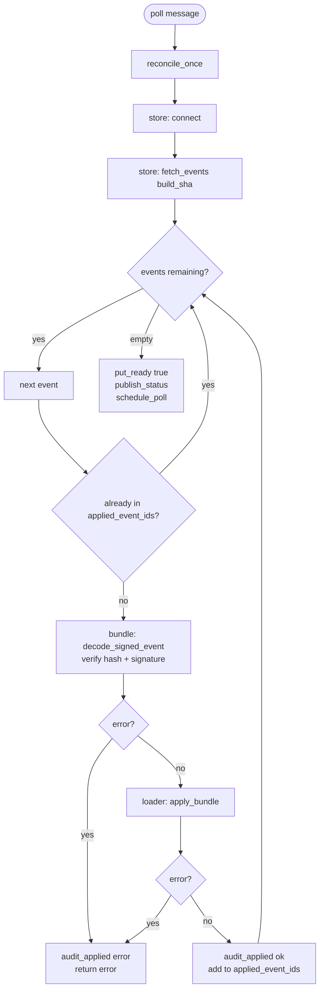

# Hot Patching

The hotpatch subsystem loads new BEAM modules into a running gateway node without restarting the OTP application. It is designed for patch-level fixes to live nodes where a full rolling deployment is either too slow or too risky. The orchestrator is `gateway_hotpatch_reconciler`, a `gen_server` started unconditionally by `fluxer_gateway_sup` (see [otp-supervision-tree.md](otp-supervision-tree.md)).

Hotpatching only activates when `hotpatch_enabled` is `true`. When it is disabled the reconciler immediately marks the node ready and the rest of the subsystem is idle.

---

## Reconciler state

`gateway_hotpatch_reconciler` holds all mutable runtime context in a single `#state{}` record:

| Field | Type | Default | Purpose |
|---|---|---|---|
| `enabled` | `boolean()` | `false` | Whether hotpatching is active for this node |
| `build_sha` | `binary()` | `<<"dev">>` | The build identifier used to scope events in the store |
| `public_keys` | `#{binary() => binary()}` | `#{}` | Map of key ID to raw 32-byte Ed25519 public key |
| `applied_event_ids` | `[term()]` | `[]` | IDs of every event applied in this process lifetime |
| `applied_count` | `non_neg_integer()` | `0` | Total events applied (used in status reporting) |
| `poll_interval_ms` | `pos_integer()` | `5000` | Milliseconds between poll cycles; minimum enforced at 1000 |
| `last_error` | `term()` | `undefined` | Last reconcile error, surfaced in `status/0` |

`build_sha` comes from the `BUILD_SHA` environment variable, falling back to `BUILD_VERSION`, then `<<"dev">>` via `gateway_hotpatch_runtime:build_sha/0`.

---

## Startup sequence



On `init_enabled` the reconciler:

1. Sets `ready = false` in `persistent_term` immediately so no session starts can pass the readiness gate.
2. Reads `hotpatch_public_keys` from the environment and parses them with `gateway_hotpatch_bundle:parse_public_keys/1`. Missing or malformed keys skip the startup reconcile and start polling.
3. Calls `finish_enabled_startup/1`, which computes a deadline from `hotpatch_startup_sync_timeout_ms` (default 30 000 ms) and calls `startup_reconcile/2`.
4. `startup_reconcile/2` calls `reconcile_once/1`. On failure it calls `gateway_retry_timer:wait_until/2` with `?STARTUP_RECONCILE_RETRY_MS = 1000` and the deadline, then retries. If the deadline has already passed `wait_until` returns `expired` immediately.
5. On timeout `finish_startup_reconcile/2` logs an error, leaves the node not-ready, and starts the poll loop anyway so recovery is automatic.

### `gateway_retry_timer:wait_until/2`

```erlang
wait_until(DelayMs, DeadlineMs) -> ok | expired | {error, invalid_delay}
```

`wait_until` checks whether the monotonic clock has already passed `DeadlineMs`. If so it returns `expired` without sleeping. Otherwise it sleeps for `min(DelayMs, DeadlineMs - NowMs)` using a one-shot Erlang timer, then returns `ok`. The caller is responsible for re-checking the deadline after `ok` to decide whether to retry.

This is used exclusively in the startup reconcile loop. The running poll loop does not use `wait_until`; it uses `erlang:send_after/3` via `schedule_poll/1`.

---

## Poll cycle

After startup the reconciler sends itself a `poll` message on each cycle:



The next poll is scheduled with `schedule_poll/1` at the end of every cycle regardless of success or failure. The interval is `state.poll_interval_ms`, which is at least 1 000 ms.

On `fetch_events_failed` the reconciler preserves the current readiness value rather than flipping to not-ready. Any other reconcile error sets `ready = false`.

---

## External store: `gateway_hotpatch_store`

The store is a Cassandra (CQL) backend accessed via `erlcass`.

### `connect/0`

Reads `hotpatch_cassandra_hosts` from the environment. Starts the `erlcass` application if not already running, configures contact points and credentials (`hotpatch_cassandra_username` / `hotpatch_cassandra_password`), and prepares three named statements:

| Statement atom | Table |
|---|---|
| `gateway_hotpatch_fetch_events_by_build` | `gateway_hotpatch_events_by_build` |
| `gateway_hotpatch_append_event` | `gateway_hotpatch_events_by_build` |
| `gateway_hotpatch_audit_applied` | `gateway_hotpatch_applied_by_node` |

Returns `ok` or `{error, Reason}`.

### `fetch_events/1`

```erlang
fetch_events(BuildSha :: binary()) -> {ok, [map()]} | {error, term()}
```

Executes the `gateway_hotpatch_fetch_events_by_build` prepared statement with `BuildSha` as the partition key. Each row is normalised by `normalize_event_row/1` into a map with the following keys:

| Key | Type |
|---|---|
| `event_id` | `binary()` (time UUID) |
| `schema_version` | integer |
| `kind` | `binary()` (e.g. `<<"beam_bundle">>`) |
| `created_by` | `binary()` |
| `signer_key_id` | `binary()` |
| `bundle_sha256` | `binary()` (32 bytes) |
| `signature` | `binary()` |
| `bundle` | `binary()` (compressed term) |

Rows that do not match the expected column layout are silently dropped by `normalize_event_row/1`.

### `audit_applied/5`

```erlang
audit_applied(BuildSha, NodeName, EventId, Summary, Result) -> ok | {error, term()}
```

Writes a row to `gateway_hotpatch_applied_by_node` recording which node applied which event at what time. `Summary` is a map containing at least `bundle_sha256` and `module_count`. `Result` is `ok` or `{error, Reason}`, stored as `<<"ok">>` or `<<"error">>` with the formatted reason in a separate column.

A failed audit write logs a warning but does not abort the apply cycle.

---

## Signature verification: `gateway_hotpatch_bundle`

### `decode_signed_event/2`

```erlang
decode_signed_event(Event :: map(), PublicKeys :: #{binary() => binary()})
    -> {ok, map()} | {error, term()}
```

The function performs three checks in order:

1. **Hash validation** — computes `SHA-256(bundle_bytes)` and compares it against `bundle_sha256` from the event row. Returns `{error, {bundle_hash_mismatch, ...}}` on mismatch.
2. **Signature verification** — looks up `signer_key_id` in `PublicKeys`. Returns `{error, {unknown_signer, KeyId}}` if the key is not present. Verifies with `crypto:verify(eddsa, none, SigningPayload, Signature, [PublicKey, ed25519])` where `SigningPayload = <<?DOMAIN/binary, 0, CompressedBundle/binary>>` and `?DOMAIN = <<"fluxer-gateway-hotpatch-v1">>`. An invalid signature returns `{error, invalid_signature}`.
3. **Bundle decompression** — decompresses the bundle bytes with `ezstd:decompress/1` and calls `binary_to_term(Bytes, [safe])`. The result must be a `map()`; any other term returns `{error, {invalid_bundle_term, ...}}`.

Returns `{ok, BundleMap}` only when all three checks pass.

### Public key configuration

`hotpatch_public_keys` is a binary containing one or more `key_id:base64_encoded_public_key` entries separated by commas, semicolons or newlines. Both standard Base64 and URL-safe Base64 are accepted. Keys must decode to exactly 32 bytes (Ed25519). An empty or missing key set is treated as a configuration error and keeps the node not-ready.

---

## Module loading: `gateway_hotpatch_loader`

### `apply_bundle/1`

```erlang
apply_bundle(Bundle :: map()) -> {ok, Summary :: map()} | {error, term()}
```

Validates that `Bundle.version == 1` and `Bundle.build_sha` matches `gateway_hotpatch_runtime:build_sha()`. A mismatch returns `{error, {build_sha_mismatch, ...}}` immediately. Both atom and binary map keys are accepted.

For each module entry in `Bundle.modules`:

1. Validates the entry has `module`, `expected_current_md5` (16 bytes), `target_md5` (16 bytes), and `beam_zstd` fields.
2. Decompresses `beam_zstd` with `ezstd:decompress/1`.
3. Validates the BEAM module name matches the entry's `module` field.
4. Validates the BEAM MD5 matches `target_md5`.
5. Calls `current_md5/1` on the live module:
   - If it equals `target_md5`, the module is already at the target version and is marked `skipped`.
   - If it equals `expected_current_md5`, the module is at the expected pre-patch version and loading proceeds.
   - Any other MD5 returns `{error, {md5_mismatch, Module, CurrentHex, ExpectedHex}}`.
6. Calls `code:soft_purge/1` then `code:load_binary/3`. After loading, stores the target MD5 in `persistent_term` keyed by `{gateway_hotpatch_loader, loaded_md5, Module}` and verifies the live module MD5 matches.

The summary map contains `applied`, `skipped` (lists of `{Module, Md5Hex}` tuples) and `module_count`. A failure on any entry stops processing and returns `{error, Reason}`; modules already loaded in that batch remain loaded.

---

## Readiness gate: `gateway_hotpatch_runtime`

`gateway_hotpatch_runtime` is a thin module that reads and writes two `persistent_term` keys:

| Key | Purpose |
|---|---|
| `{gateway_hotpatch, ready}` | Boolean readiness flag |
| `{gateway_hotpatch, status}` | Status map surfaced by `status/0` |

### `put_ready/1` and `is_ready/0`

```erlang
put_ready(Ready :: boolean()) -> ok
is_ready() -> boolean()
```

`is_ready/0` returns `true` unless `persistent_term` explicitly holds `false`. This means a fresh node with no entry is treated as ready, which is the correct behaviour when hotpatching is disabled.

`gateway_node_router:is_ready/0` calls `gateway_hotpatch_reconciler:is_ready/0`, which delegates to `gateway_hotpatch_runtime:is_ready/0`. Session starts and inbound NATS RPC routing both check `is_ready()` before accepting work (see [clustering-nats-rpc.md](clustering-nats-rpc.md)). A node that has not yet completed its startup reconcile will refuse new session connections until `put_ready(true)` is called.

### `status/0`

Returns the last status map written by `publish_status/2`. The map contains `enabled`, `ready`, `build_sha`, `applied_count` and `last_error`. It is served by the `/_health/ready` endpoint and by the `status` call on the reconciler gen_server.

---

## Event ID deduplication

The reconciler keeps `applied_event_ids` as an in-memory list in the gen_server state. Before processing any event, `lists:member(EventId, State#state.applied_event_ids)` is called. Events already in the list are skipped without re-verification or re-loading. The list is not persisted; it resets on node restart, which is correct since `fetch_events/1` will re-fetch events and the loader's `current_md5` check will mark them as `skipped` if the module is already at the target version.

---

## Error handling summary

| Failure point | Effect on readiness | Poll continues? |
|---|---|---|
| Missing or invalid public keys | Not ready | Yes |
| `store:connect` failure | Unchanged from current | Yes |
| `fetch_events` failure | Unchanged from current | Yes |
| Signature or hash verification failure | Not ready | Yes |
| `apply_bundle` failure | Not ready | Yes |
| Audit write failure | No effect | Yes |
| Startup sync timeout | Not ready | Yes |

---

## Relationship to supervision tree and clustering

`gateway_hotpatch_reconciler` is child 8 in `fluxer_gateway_sup` and starts before any role-gated children. This ordering ensures the readiness gate is in place before sessions or guild processes start accepting connections. For the full child ordering see [otp-supervision-tree.md](otp-supervision-tree.md).

The `is_ready()` check is also consulted by `gateway_node_router` when deciding whether a node is eligible to receive routed work. A node undergoing a startup reconcile that has not yet reached `put_ready(true)` will not be selected as a routing target by peer nodes in the cluster. See [clustering-nats-rpc.md](clustering-nats-rpc.md) for the routing logic.
