# OTP Supervision Tree

`fluxer_gateway_sup` is the root supervisor for the gateway OTP application. It is started by `fluxer_gateway_app` as described in [architecture-overview.md](architecture-overview.md).

## Supervisor strategy

```erlang
SupFlags = #{
    strategy => one_for_one,
    intensity => 5,
    period => 10
}
```

`one_for_one` means each child is restarted independently when it crashes — a failing `gateway_nats_rpc` does not restart `session_manager`. The `intensity=5, period=10` threshold allows at most 5 restarts within any rolling 10-second window. If that limit is exceeded the supervisor itself terminates, bringing down the entire gateway node.

Every child spec uses `restart => permanent` (always restart on exit) and `shutdown => 5000` (5 second graceful shutdown window).

## Child startup order

Children are added to the supervisor in a fixed order. OTP starts them sequentially in list order, so position in the list is the startup order.

### Common children (always started)

| # | Id | Module | Role |
|---|---|---|---|
| 1 | `gateway_http_client` | `gateway_http_client` | Outbound HTTP client pool used by hotpatch store and other subsystems |
| 2 | `guild_ets_owner` | `guild_ets_owner` | Creates and owns the shared ETS tables; must start before any process that reads them |
| 3 | `gateway_nats_rpc` | `gateway_nats_rpc` | NATS RPC server — subscribes to inbound RPC subjects and dispatches to handler workers |
| 4 | `gateway_nats_pool` | `gateway_nats_pool` | Multi-connection NATS pool for publish throughput |
| 5 | `gateway_event_pause` | `gateway_event_pause` | Coordinates event delivery pausing during hotpatch apply |
| 6 | `gateway_concurrency` | `gateway_concurrency` | Tracks and limits concurrent in-flight operations |
| 7 | `gateway_rollout_config` | `gateway_rollout_config` | Holds live rollout feature flags fetched from the config store |
| 8 | `gateway_hotpatch_reconciler` | `gateway_hotpatch_reconciler` | Polls for hotpatch bundles, verifies signatures, applies BEAM modules; blocks session acceptance until ready |
| *(cluster-conditional)* | `gateway_cluster_discovery` | `gateway_cluster_discovery` | Discovers peer nodes and writes membership to persistent_term |
| *(cluster-conditional)* | `gateway_cluster_membership` | `gateway_cluster_membership` | Tracks live members via `pg`; maintains `members` and `members_by_role` persistent terms |
| *(cluster-conditional)* | `gateway_pg_scope` | `gateway_pg_scope` | Starts the `pg` scope used for cluster-wide process groups |
| 9 | `gateway_dispatch_relay` | `gateway_dispatch_relay` | Relays dispatched events to local subscribers |
| 10 | `gateway_periodic_gc` | `gateway_periodic_gc` | Periodically triggers a major GC pass across the node |
| 11 | `process_health_watchdog` | `process_health_watchdog` | Monitors process liveness metrics and reports anomalies |

### Cluster-conditional children

`cluster_children/0` checks `fluxer_gateway_env:get(cluster_enabled)`. When `true`, three children are inserted between `gateway_hotpatch_reconciler` and `gateway_dispatch_relay`:

- `gateway_cluster_discovery` — node discovery
- `gateway_cluster_membership` — live membership tracking via `pg`
- `gateway_pg_scope` — the `pg` scope process itself

When `cluster_enabled` is not `true`, this block is empty and no cluster processes start.

### `gateway_periodic_gc` and `process_health_watchdog`

These two children are the last common children started, after all routing and clustering infrastructure is up.

`gateway_periodic_gc` schedules a recurring timer that calls `erlang:garbage_collect/0` across all processes to force a major sweep. This counteracts long-lived processes accumulating heap between natural GC triggers. See [telemetry.md](telemetry.md) for the full telemetry context.

`process_health_watchdog` continuously samples process liveness via `process_liveness` and logs or alerts when processes stop responding. It depends on `process_registry` being available at runtime. Full details in [telemetry.md](telemetry.md).

## `guild_ets_owner` ordering constraint

`guild_ets_owner` creates the ETS tables (including `guild_pid_cache` and related tables) that several other processes read at startup or during operation. It is placed at position 2 — immediately after `gateway_http_client` — so that any subsequent child can safely access those tables.

The following processes depend on the tables being present:

| Process | Dependency |
|---|---|
| `gateway_nats_rpc` | reads guild ETS for routing inbound RPC to the correct guild process |
| `guild_manager` | inserts into `guild_pid_cache` when starting guild gen_servers |
| `voice_state_counts_sync` | reads guild ETS for voice state aggregation |
| `call_manager` | reads guild ETS when resolving call targets |
| `session_manager` | reads guild ETS when attaching sessions to guilds |

The EUnit tests in `fluxer_gateway_sup` verify this ordering for every relevant role:

- `guild_role_starts_ets_owner_before_guild_workers_test`
- `calls_role_starts_ets_owner_before_call_workers_test`
- `sessions_role_starts_ets_owner_before_session_workers_test`
- `websocket_role_starts_ets_owner_before_rpc_workers_test`

## Role-gated children

After the common children, `role_children/1` appends children conditioned on `GATEWAY_ROLE`. The active role is read from `fluxer_gateway_env:get(gateway_role)` and normalised by `normalize_role/1`. A missing value (`undefined`) defaults to `all`; any other unrecognised value defaults to `websocket`.

`role_enabled(RoleName, CurrentRole)` returns `true` when `CurrentRole =:= all` or `CurrentRole =:= RoleName`. Only matching children are appended.

### `presence_bus`

`presence_bus` is added first among role children when either `presence` or `guilds` is enabled. It provides the sharded fan-out bus that guild processes use to receive user presence updates.

### Per-role children

| `GATEWAY_ROLE` | Children added |
|---|---|
| `sessions` | `session_state_transfer`, `session_manager` |
| `presence` | `presence_cache`, `presence_manager` |
| `guilds` | `guild_counts_cache`, `guild_manager`, `voice_state_counts_sync` |
| `calls` | `call_manager` (plus `voice_state_counts_sync` when `guilds` is not also active) |
| `push` | `push_dispatcher`, `push` |

`all` enables every row above. `websocket` enables none — the WebSocket handler role runs no session, guild, presence, call, or push processes. The common children still start under `websocket`.

`voice_state_counts_sync` appears under `guilds` when that role is active. Under `calls` it is added only when `guilds` is not also active, preventing a duplicate child ID.

### `gateway_cluster_handoff`

`role_handoff_children/1` checks whether any state-holding role (`sessions`, `presence`, `guilds`, `calls`, or `push`) is active and whether `cluster_enabled=true`. When both are true, `gateway_cluster_handoff` is appended last. It coordinates session and guild drain transfers during rolling deployments. Under `websocket` alone it is never started.

## Full supervision tree

```mermaid
graph TD
    SUP["fluxer_gateway_sup<br/>(one_for_one, intensity=5, period=10)"]

    SUP --> GHC["gateway_http_client<br/>(always)"]
    SUP --> GEO["guild_ets_owner<br/>(always)"]
    SUP --> GNRPC["gateway_nats_rpc<br/>(always)"]
    SUP --> GNP["gateway_nats_pool<br/>(always)"]
    SUP --> GEP["gateway_event_pause<br/>(always)"]
    SUP --> GC["gateway_concurrency<br/>(always)"]
    SUP --> GRC["gateway_rollout_config<br/>(always)"]
    SUP --> GHR["gateway_hotpatch_reconciler<br/>(always)"]

    SUP --> GCD["gateway_cluster_discovery<br/>(cluster_enabled=true)"]
    SUP --> GCM["gateway_cluster_membership<br/>(cluster_enabled=true)"]
    SUP --> GPS["gateway_pg_scope<br/>(cluster_enabled=true)"]

    SUP --> GDR["gateway_dispatch_relay<br/>(always)"]
    SUP --> GPGC["gateway_periodic_gc<br/>(always)"]
    SUP --> PHW["process_health_watchdog<br/>(always)"]

    SUP --> PB["presence_bus<br/>(presence or guilds role)"]

    SUP --> SST["session_state_transfer<br/>(sessions role)"]
    SUP --> SM["session_manager<br/>(sessions role)"]

    SUP --> PC["presence_cache<br/>(presence role)"]
    SUP --> PM["presence_manager<br/>(presence role)"]

    SUP --> GCC["guild_counts_cache<br/>(guilds role)"]
    SUP --> GM["guild_manager<br/>(guilds role)"]
    SUP --> VSCS["voice_state_counts_sync<br/>(guilds role, or calls when guilds absent)"]

    SUP --> CM["call_manager<br/>(calls role)"]

    SUP --> PD["push_dispatcher<br/>(push role)"]
    SUP --> PUSH["push<br/>(push role)"]

    SUP --> GCH["gateway_cluster_handoff<br/>(cluster_enabled=true + any state role)"]

    GEO -. "ETS tables must exist before" .-> GNRPC
    GEO -. "ETS tables must exist before" .-> GM
    GEO -. "ETS tables must exist before" .-> VSCS
    GEO -. "ETS tables must exist before" .-> CM
    GEO -. "ETS tables must exist before" .-> SM
```



> The dashed arrows represent the ordering constraint: `guild_ets_owner` creates the ETS tables that these processes require. Because OTP starts children in list order, `guild_ets_owner`'s position at index 2 guarantees the tables exist before any dependent child initialises.
