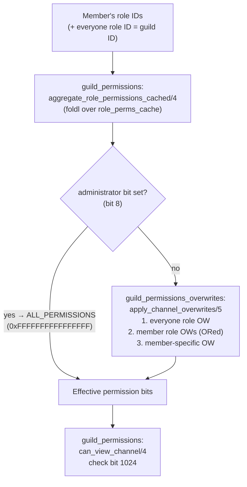

# Permissions

The permissions system controls which guild members can see which channels and perform which actions. It is used throughout the dispatch pipeline (see [event-dispatch-pipeline.md](event-dispatch-pipeline.md)) and on session connect to build the filtered `GUILD_CREATE` payload.

---

## Bitfield model

Permissions are non-negative integers where each bit represents one capability. A member's effective permissions for a given channel are computed in two stages:

1. **Guild-level**: aggregate the permission bits from every role the member holds (ORed together, starting from the everyone role).
2. **Channel-level**: overlay the channel's `permission_overwrites` on top of the guild-level bits.

The result is a single integer. Callers test individual capabilities by masking that integer against a named constant.

---

## Pipeline overview



Guild owner resolution happens before this pipeline: if the requesting user ID equals the guild `owner_id`, the computation short-circuits immediately to `?ALL_PERMISSIONS = 0xFFFFFFFFFFFFFFFF` without examining roles or overwrites.

---

## `guild_permissions.erl`

**Public API module**. All callers outside the permissions subsystem go through this module.

### `can_view_channel/4`

```erlang
can_view_channel(UserId, ChannelId, Member, State) -> boolean()
```

Delegates to `guild_permissions_check:can_view_channel/4`, which returns `true` when any of the following holds:

- The user has virtual channel access granted by `guild_virtual_channel_access` (used to keep voice participants visible after a permission change removes normal access).
- `compute_member_permissions/4` produces a bitset with bit 1024 (`view_channel`) set.
- The channel is a category (type 4) and the user can view at least one child channel by permissions.

### `can_view_channel_by_permissions/4`

Strict permission check only. Skips virtual access and category inheritance. Used by `guild_dispatch_filter` when evaluating whether a non-category event is visible to a session.

### `compute_member_permissions/4`

```erlang
compute_member_permissions(UserId, ChannelId, ProvidedMember, State) -> permission()
```

Full permission computation:

1. Resolves the guild data map from `State`.
2. Checks owner short-circuit (`UserId =:= OwnerId` → `?ALL_PERMISSIONS`).
3. Resolves the member (from `ProvidedMember` if provided, otherwise via `find_member_by_user_id/2`). Returns `0` if the user is not a member.
4. Reads the everyone role permissions (keyed by `GuildId`) from `role_perms_cache`.
5. Calls `aggregate_role_permissions_cached/4` to OR in all member role bits.
6. Checks the `administrator` bit. If set, returns `?ALL_PERMISSIONS`.
7. Otherwise calls `guild_permissions_overwrites:maybe_apply_channel_overwrites/6`.

### `find_member_by_user_id/2`

```erlang
find_member_by_user_id(UserId, State) -> member() | undefined
```

Resolves the guild data map and then looks up the member. Lookup strategy (in priority order):

1. If `Data` contains a `members_ets` key pointing to a live ETS table (`ets:tid()`), uses `ets:lookup(Tab, UserId)`. This is the fast path for live guild processes.
2. If `<<"members">>` is a map (keyed by user ID), uses `snowflake_id:get/3`.
3. If `<<"members">>` is a list, scans linearly by matching `member.user.id`.

Returns `undefined` when the user is not a member of the guild.

### `aggregate_role_permissions_cached/4`

```erlang
aggregate_role_permissions_cached(MemberRoles, Cache, Roles, BasePermissions) -> permission()
```

`foldl` over the member's role ID list. For each role, checks `role_perms_cache` (a map of `role_id => permission()` stored inside the guild data). On a cache hit, calls `permission_bits:add/2`. On a miss, looks up the role in the full `Roles` index and adds its raw permission bits. Returns the accumulated OR of all role permissions plus `BasePermissions` (the everyone role bits).

---

## `guild_permissions_overwrites.erl`

### `apply_channel_overwrites/5`

```erlang
apply_channel_overwrites(BasePerms, UserId, MemberRoles, Channel, EveryoneRoleId) -> permission()
```

Reads `channel.permission_overwrites` (a list of overwrite maps). Applies in this fixed order:

1. **Everyone role overwrite**: finds the overwrite entry where `type = 0` and `id = EveryoneRoleId`. Calls `apply_allow_deny(BasePerms, Allow, Deny)`.
2. **Member role overwrites**: iterates `MemberRoles`; for each role, finds the matching overwrite (`type = 0`, `id = RoleId`) and accumulates `{RoleAllow, RoleDeny}` by ORing the individual `allow`/`deny` bits. Applies the combined pair once with `permission_bits:apply_allow_deny/3`.
3. **Member-specific overwrite**: finds the overwrite entry where `type = 1` and `id = UserId`. Applies `allow`/`deny` directly.

Each allow/deny value is parsed with `permission_bits:parse/1`, which accepts an integer, a decimal binary string, or a char list.

### `apply_cached_overwrites/5`

Fast path variant used when the channel's overwrites have been pre-built into the `overwrite_perms_cache`. The cached format is a list of `{Id, Type, Allow, Deny}` 4-tuples stored in `guild_data` under `overwrite_perms_cache`. The merge order is identical to `apply_channel_overwrites/5`.

### `maybe_apply_channel_overwrites/6`

Called from `guild_permissions:compute_member_permissions/4` after the administrator check. Returns `Permissions` unchanged when `ChannelId` is `undefined`. When a channel ID is provided, checks `overwrite_perms_cache` first (`apply_cached_overwrites/5`) and falls back to `apply_from_channel_lookup` if the channel is not cached.

---

## `guild_permission_cache.erl`

### ETS structure

The module uses a single named ETS table `guild_permission_cache` with the following properties:

```erlang
[named_table, public, set, {read_concurrency, true}]
```

Each entry is `{GuildId :: integer(), Snapshot :: map()}` where `Snapshot` has the shape:

```erlang
#{
    id   => GuildId,
    data => #{
        <<"guild">>              => #{<<"owner_id">> => integer()},
        <<"members">>            => #{UserId => stripped_member()},
        <<"roles">>              => [stripped_role()],
        <<"channels">>           => [stripped_channel()],
        <<"channel_index">>      => #{ChannelId => stripped_channel()},
        <<"member_role_index">>  => map(),
        role_perms_cache         => #{RoleId => permission()},
        overwrite_perms_cache    => #{ChannelId => [{Id, Type, Allow, Deny}]}
    }
}
```

`strip_data/1` discards fields not needed for permission computation. Roles keep only `id`, `permissions` and `position`. Channels keep only `id`, `name`, `type`, `parent_id` and `permission_overwrites`. Members keep `user.id`, `roles` and `communication_disabled_until`.

The table is created lazily by `ensure_table/0` (backed by `guild_ets_utils:ensure_table/2`). It is owned by `guild_ets_owner` so it outlives individual guild processes.

### Writing

- `put_state/1`: extracts `id` and `data` from a guild state map and calls `put_normalized_data/2`.
- `put_data/2`: normalises raw data with `guild_data_index:normalize_data/1` before storing.
- `put_normalized_data/2`: calls `strip_data/1` then inserts `{GuildId, Snapshot}`.

### Reading

- `get_snapshot/1`: `ets:lookup` by guild ID. Returns `{ok, Snapshot}` or `{error, not_found}`.
- `get_permissions/3`: calls `get_snapshot/1` then `guild_permissions:get_member_permissions/3`.
- `has_member/2`, `get_member/2`: call `get_snapshot/1` then `guild_permissions:find_member_by_user_id/2`.

### Invalidation

The cache is invalidated by any event that mutates guild structure. The predicate `event_mutates_guild_data/1` in `guild.erl` returns `true` for:

`guild_member_add`, `guild_member_update`, `guild_member_remove`, `guild_role_create`, `guild_role_update`, `guild_role_update_bulk`, `guild_role_delete`, `channel_create`, `channel_update`, `channel_update_bulk`, `channel_delete`, `guild_update`

When `guild.erl:dispatch_event/3` processes an event matching this predicate, it calls `maybe_refresh_permission_cache` which writes a fresh snapshot via `put_state/1`. The old entry is overwritten atomically. Deletion happens in `guild_maintenance:maybe_delete_permission_cache` called from the guild termination path (see [guild-gen-server.md](guild-gen-server.md)).

---

## `permission_bits.erl`

A thin type-alias wrapper over `bitset.erl`. Every exported function delegates directly:

| Function | Erlang expression |
|---|---|
| `parse/1` | `bitset:parse/1` |
| `parse_optional/1` | `bitset:parse_optional/1` |
| `parse_maybe/1` | `bitset:parse_maybe/1` |
| `has(Bits, Bit)` | `bitset:has(Bits, Bit)` |
| `any(Bits, Mask)` | `bitset:any(Bits, Mask)` |
| `add(Bits, Mask)` | `bitset:add(Bits, Mask)` |
| `remove(Bits, Mask)` | `bitset:remove(Bits, Mask)` |
| `apply_allow_deny(Bits, Allow, Deny)` | `bitset:apply_allow_deny(Bits, Allow, Deny)` |

The `-type t() :: bitset:t()` alias means Eqwalizer treats `permission_bits:t()` and `bitset:t()` as the same concrete type (`non_neg_integer()`).

---

## `bitset.erl`

Core bit-manipulation primitives. All values are `non_neg_integer()`.

### `parse/1`

Accepts three input forms:

| Input type | Behaviour |
|---|---|
| `non_neg_integer()` | Returned as-is |
| `binary()` | Parsed as ASCII decimal digits; raises `{invalid_bitset, Value}` on any non-digit byte or empty binary |
| `char_list()` (iolist) | Same decimal parsing over a list of digit codepoints |

`parse_optional/1` returns `undefined` for `undefined` and `null`. `parse_maybe/1` wraps `parse_optional/1` in a `try/catch` and returns `undefined` on error instead of raising.

### Operations

| Function | Erlang | Description |
|---|---|---|
| `has(Bits, Bit)` | `(Bits band Bit) =:= Bit` | True when all bits in `Bit` are set |
| `any(Bits, Mask)` | `(Bits band Mask) =/= 0` | True when at least one bit in `Mask` is set |
| `add(Bits, Mask)` | `Bits bor Mask` | Sets all bits in `Mask` |
| `remove(Bits, Mask)` | `Bits band bnot Mask` | Clears all bits in `Mask` |
| `apply_allow_deny(Bits, Allow, Deny)` | `add(remove(Bits, Deny), Allow)` | Deny applied first, then allow |

`apply_allow_deny/3` is the fundamental operation for channel overwrite merging: deny bits are cleared, then allow bits are set. This means allow always wins over deny when both are specified for the same bit.

---

## Named permission constants (`constants.erl`)

All values are returned by functions in `constants.erl` and used as the `Bit` argument to `permission_bits:has/2`.

| Constant function | Bit value | Notes |
|---|---|---|
| `administrator_permission/0` | `8` | Short-circuits to all permissions |
| `manage_channels_permission/0` | `16` | |
| `view_audit_log_permission/0` | `128` | |
| `stream_permission/0` | `512` | Voice streaming |
| `view_channel_permission/0` | `1 024` | Gate for `can_view_channel` |
| `read_message_history_permission/0` | `65 536` | |
| `connect_permission/0` | `1 048 576` | Voice channel entry |
| `speak_permission/0` | `2 097 152` | |
| `use_vad_permission/0` | `33 554 432` | |
| `manage_roles_permission/0` | `268 435 456` | |
| `view_channel_members_permission/0` | `18 014 398 509 481 984` | |
| `kick_members_permission/0` | `2` | |
| `ban_members_permission/0` | `4` | |

`?ALL_PERMISSIONS` is defined as `16#FFFFFFFFFFFFFFFF` (all 64 bits set) in `guild_permissions.erl` and is returned for guild owners and administrator-role holders.

---

## `guild_visibility.erl`

`guild_visibility` is a facade over `guild_visibility_channels` and `guild_visibility_overwrites`. It is used at two points:

1. **Session connect**: `guild_visibility_channels:get_user_viewable_channels/2` returns the list of channel IDs the connecting user can see. This list populates the `channels` array in the `GUILD_CREATE` payload sent to the session. See [session-lifecycle.md](session-lifecycle.md) for where this is called during `session_connect`.

2. **Overwrite change events**: `compute_and_dispatch_visibility_changes/2` (and the per-user and per-channel variants) diff the old and new guild states to find users whose channel visibility changed and dispatch the appropriate synthetic events.

### `get_user_viewable_channels/2`

```erlang
get_user_viewable_channels(UserId, State) -> [channel_id()]
```

1. Resolves `State.data.channels` (list of channel maps).
2. Calls `find_member_by_user_id/2`. Returns `[]` immediately if the user is not a member.
3. For each channel, calls `guild_permissions:can_view_channel/4`. Collects viewable channel IDs.
4. For each viewable channel that has a `parent_id`, records the parent. After the main pass, any parent category not already in the viewable set is added so the client receives its category container.

### `viewable_channel_set/2`

Returns a `sets:set(channel_id())`. Checks the `sessions` map in `State` for a cached `viewable_channels` map belonging to this user ID before recomputing.

### `have_shared_viewable_channel/3`

Used by presence and member-list logic to determine whether two users share any visible channel, enabling presence updates to be delivered. Returns `false` when `UserId =:= OtherUserId`.

---

## Interaction with the dispatch pipeline

`guild_dispatch_filter:filter_sessions_for_event` calls `guild_permissions:can_view_channel/4` for each connected session when an event is scoped to a channel. Only sessions for which this returns `true` receive the event. See [event-dispatch-pipeline.md](event-dispatch-pipeline.md) for the full filter step.

Voice channel permission checks (`connect`, `speak`, `use_vad`, `stream`) are handled separately in `guild_voice_permissions.erl` before a voice state update is accepted; see [voice.md](voice.md).

The shared utilities `bitset.erl` and `permission_bits.erl` are also described in [shared-utilities.md](shared-utilities.md).
