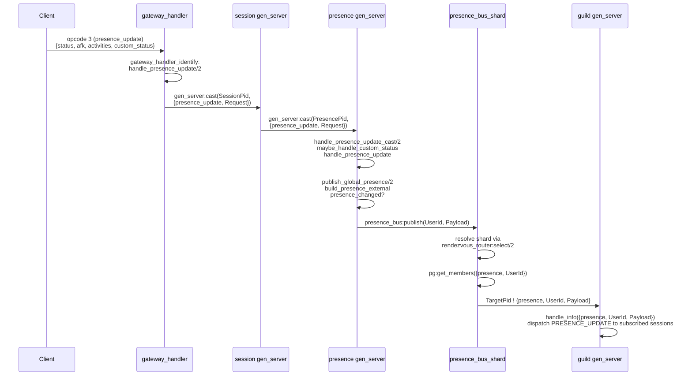

# Presence Subsystem

This document describes the presence subsystem: the per-user `presence` gen_server, its state, the `presence_bus` fan-out layer, `presence_cache` for cross-node lookups, `presence_broadcast` publication, and `presence_manager` for shard-based routing. Related context: [session-lifecycle.md](session-lifecycle.md) covers how sessions attach to a presence process. [guild-gen-server.md](guild-gen-server.md) covers how guild processes subscribe to the bus and receive `{presence, UserId, Payload}` messages.

---

## Overview

Each online user is represented by exactly one `presence` gen_server process, regardless of how many active sessions that user has. The process:

- Aggregates status across all sessions (online, idle, dnd, invisible, offline).
- Publishes a single derived presence payload when the effective visible status changes.
- Holds the `push_buffer`, deferring push notification delivery until a session connects.
- Dispatches incoming `PRESENCE_UPDATE` events from other users to all local sessions.

The subsystem is split across six modules:

| Module | Responsibility |
|---|---|
| `presence` | gen_server entry point, callback routing |
| `presence_broadcast` | Publication to `presence_bus` and `presence_cache`; fan-out to sessions |
| `presence_bus` | Sharded fan-out coordinator (parent gen_server) |
| `presence_bus_shard` | Per-shard `pg`-backed subscriber registry and publisher |
| `presence_cache` | Sharded ETS-backed presence cache with cluster rebalance |
| `presence_manager` | Shard-based process registry; start/stop/lookup routing |
| `presence_update` | `push_buffer` management; custom status validation; settings-driven status |

---

## `presence` gen_server State

The state record type is defined in `presence.erl`:

```erlang
-type state() :: #{
    user_id                := user_id(),
    user_data              := map(),
    sessions               := sessions(),
    push_buffer            := [push_buffer_entry()],
    custom_status          := custom_status(),
    status                 := status(),
    guild_ids              := #{integer() => true},
    temporary_guild_ids    := #{integer() => true},
    friends                := #{user_id() => true},
    group_dm_recipients    := #{integer() => #{user_id() => true}},
    subscriptions          := map(),
    is_bot                 := boolean(),
    initial_presences_sent := boolean(),
    last_published_presence := map() | undefined
}.
```

Key fields:

- `user_id` — integer user ID; the primary key for routing and cache lookups.
- `user_data` — normalized user map published alongside presence payloads.
- `sessions` — map of `session_id => session_entry`. Each entry holds `status`, `afk`, `mobile`, `pid`, `mref`, and `socket_pid`. The effective visible status and mobile/AFK flags are derived from this map when publishing.
- `push_buffer` — list of `{channel_id, message_id, params}` entries for undelivered push notifications. Entries accumulate while no active non-AFK session exists. Bounded by `presence_push_buffer_max_entries` (default 128) and `presence_push_buffer_max_bytes` (default 1 MiB). Entries prepend to the list; the list is reversed on flush.
- `custom_status` — the user's custom status map or `null`.
- `status` — the last resolved effective status atom (`online | idle | dnd | invisible | offline`). Derived from session statuses on each publish.
- `guild_ids` — set of guild IDs the user belongs to, used to route bus subscriptions.
- `temporary_guild_ids` — guild IDs added transiently (e.g. during guild browsing).
- `friends` — set of friend user IDs. Empty for bots (see bot handling below).
- `group_dm_recipients` — map of `channel_id => #{user_id => true}` for group DMs.
- `subscriptions` — map tracking active `presence_bus` subscriptions by user ID.
- `is_bot` — when `true`, `friends` is forced to `[]` at init and group DM subscriptions are normalized to `#{}`.
- `initial_presences_sent` — set to `true` once cached presences have been delivered to the first session.
- `last_published_presence` — the external presence shape last published to the bus and cache. Used by `presence_changed/2` to suppress redundant publishes.

---

## Bot Handling

`select_friend_ids/2` controls whether a user receives friend presence updates:

```erlang
select_friend_ids(true, _FriendIds) -> [];
select_friend_ids(false, FriendIds) -> FriendIds.
```

`true` is `IsBot`. Bots always get an empty friend list, so the presence process never subscribes to any friend's presence bus group and never delivers `PRESENCE_UPDATE` events for friends to bot sessions.

`normalize_group_dm_recipients/3` similarly short-circuits to `#{}` for bots.

---

## `presence_broadcast:publish_global_presence/2`

`publish_global_presence/2` is the central publication function. It is called in two places:

1. After `session_connect` completes successfully (in `handle_call({session_connect, ...}, ...)` in `presence.erl`).
2. After a `{presence_update, Request}` cast is processed (`handle_presence_update_cast/2`).

The function:

1. Builds the external presence payload from current session state (status, mobile, AFK, custom status, user data).
2. Compares the new external shape against `last_published_presence` using `presence_changed/2`.
3. If changed: calls `publish_presence_payload/4`, which:
   - Updates `presence_cache`: deletes the entry when status is `offline`; calls `presence_cache:put/2` otherwise.
   - Calls `presence_bus:publish(UserId, Payload)`.
   - Updates `last_published_presence` in state.
4. If unchanged: still updates the cache (idempotent) but skips the bus publish.
5. In both paths, calls `presence_update:maybe_update_push_eligibility/1` to flush the push buffer if the new session state makes the user eligible.

`force_publish_global_presence/1` bypasses the `presence_changed` guard and always publishes. It is called after `user_settings_update` events to propagate invisible status changes immediately.

---

## `presence_bus` Sharding and Fan-out

`presence_bus` is a top-level gen_server that owns a pool of `presence_bus_shard` child processes. The shard count defaults to `max(logical_processors_available, schedulers_online)` and can be overridden with the `presence_bus_shards` environment key.

For every `subscribe`, `unsubscribe`, and `publish` call, the `presence_bus` root process:

1. Computes the target shard index via `rendezvous_router:select(UserId, ShardCount)`.
2. Forwards the call to the appropriate shard (restarting it on failure).

Each `presence_bus_shard` operates a `pg` group keyed as `{presence, UserId}` within the shared presence scope (`gateway_pg_scope:presence_scope()`). This scope spans the cluster, so subscribers on any node are visible.

**Subscribe path** (guild processes): `presence_bus:subscribe(UserId)` — the calling guild process joins the `pg` group `{presence, UserId}` on the appropriate shard.

**Publish path**: `presence_bus:publish(UserId, Payload)` resolves to `presence_bus_shard:do_publish/3`, which retrieves all members of `{presence, UserId}` via `pg:get_members/2` and sends each member the message:

```erlang
TargetPid ! {presence, UserId, Payload}
```

Guild gen_server processes receive this message via `handle_info({presence, UserId, Payload}, State)` and forward it to subscribed sessions.

**Cross-node publish**: `publish_cross_node/2` is a cast (fire-and-forget) variant used when the publication originates on a remote node.

**Shard fault tolerance**: if a shard process crashes, the `presence_bus` root process detects the `DOWN` monitor, restarts the shard, and continues forwarding. The shard itself monitors the `pg` scope process and recovers by re-attaching on `EXIT`.

---

## `presence_cache`

`presence_cache` provides fast, cross-node presence lookups keyed by user ID. It is a gen_server that owns a set of ETS-backed child shards (`presence_cache_shards`).

Key API:

| Function | Description |
|---|---|
| `presence_cache:put(UserId, Presence)` | Store presence for a user (cast to owning shard) |
| `presence_cache:delete(UserId)` | Remove presence (called on offline/invisible) |
| `presence_cache:get(UserId)` | Single lookup; queries the cluster via `presence_cache_bulk:get_from_cluster/1` |
| `presence_cache:bulk_get(UserIds)` | Batch lookup across all cluster nodes |

All operations check a `presence_noop` persistent term flag; when set to `true`, the cache is fully bypassed (used in test or reduced-role deployments).

**Sharding**: `presence_cache_shards:determine_count/1` reads the `presence_cache_shards` env key, defaulting to the CPU count. Each shard holds an ETS table; `put` and `delete` route to the owning shard by user ID.

**Cluster rebalance**: `presence_cache_rebalance` handles node joins and departures. A grace period prevents premature data loss on transient `nodedown` events. Anti-entropy runs on a timer; when generation counts diverge between nodes, the lagging node requests a digest and merges missing entries.

**Visibility rule**: `presence_broadcast:cache_if_visible/2` skips caching for `offline` and `invisible` statuses so lookups return `not_found` for users who should not be visible.

---

## `presence_manager` Shard Routing

`presence_manager` is the process registry for all `presence` gen_server processes. It owns a pool of `presence_manager_shard` child processes, each responsible for a slice of user IDs.

**Routing**: All calls (`lookup`, `start_or_lookup`, `dispatch_to_user`, `terminate_all_sessions`) route through `presence_manager_routing:call_owner_manager/3`, which:

1. Computes the owning node via `rendezvous_router` (consistent hashing across cluster nodes).
2. If the owning node is local, forwards to the appropriate local shard.
3. If the owning node is remote, makes a gen_server call to the `presence_manager` on that node.

**Local cache**: `presence_manager_cache` maintains a local ETS-backed pid cache keyed by user ID. On a cache hit, `lookup/1` returns immediately without network round-trip. The cache is invalidated when the shard process that owns the entry crashes.

**Shard crash recovery**: when a shard crashes, the `presence_manager` root process:

1. Collects affected user IDs via `get_shard_user_ids/1`.
2. Restarts the shard.
3. Spawns a broadcast to trigger `presence_rejoin` casts to any surviving presence processes, so they re-register with the new shard.

**Cluster handoff**: `presence_manager:handoff_for_drain/0` is called during graceful node drain. `presence_manager_handoff:do/1`:

1. Iterates all presence processes across local shards.
2. For each user, resolves the rendezvous owner node.
3. If the owner node is a different (live) node, stops the local presence process and cleans the local cache. The presence will be restarted on the owning node when the next session connects or event arrives.

---

## `push_buffer` Deferral and Flush

When a `message_create` event arrives at the presence process, `presence_update:handle_message_create_event/2` checks `is_push_eligible/1`:

- Returns `true` if there are no sessions (user has no active connections).
- Returns `true` if all sessions have `afk = true`.
- Returns `false` otherwise (user is actively connected and not AFK).

When not eligible, the notification is appended to `push_buffer` via `buffer_push_notification/2`:

```erlang
Entry = #{channel_id => ChannelId, message_id => MessageId, params => Params}
```

The buffer is capped at `presence_push_buffer_max_entries` entries (default 128) and `presence_push_buffer_max_bytes` (default 1 MiB). The newest entries are kept when the cap is reached.

**Flush triggers**:

1. On `session_connect`: `publish_global_presence/2` calls `maybe_update_push_eligibility/1`, which flushes if the updated session map makes the user eligible.
2. On `message_ack`: `handle_message_ack_event/2` removes buffer entries for channels/messages already acknowledged by the client (`should_drop_buffer_entry/3` matches by `channel_id` and `message_id ≤ acked_message_id`).
3. On terminate: `flush_push_buffer/1` is called unconditionally in `presence:terminate/2`.

`flush_push_buffer/1` iterates `lists:reverse(Buffer)` (oldest first) and calls `push:handle_message_create/1` for each entry, then resets the buffer to `[]`.

---

## Sequence: opcode 3 Presence Update



---

## Module Reference

| Module | Responsibility |
|---|---|
| `presence` | gen_server callbacks; session connect; presence update cast |
| `presence_broadcast` | `publish_global_presence`; cache writes; bus publish; session fan-out |
| `presence_bus` | Shard pool management; subscribe/unsubscribe/publish routing |
| `presence_bus_shard` | `pg`-backed subscriber registry; `{presence, UserId, Payload}` send |
| `presence_cache` | Sharded ETS cache; cluster rebalance; anti-entropy |
| `presence_manager` | Process registry; shard routing; cache; cluster handoff |
| `presence_manager_handoff` | Drain-time transfer of presence processes to owner nodes |
| `presence_update` | `push_buffer`; custom status validation; settings status propagation |
