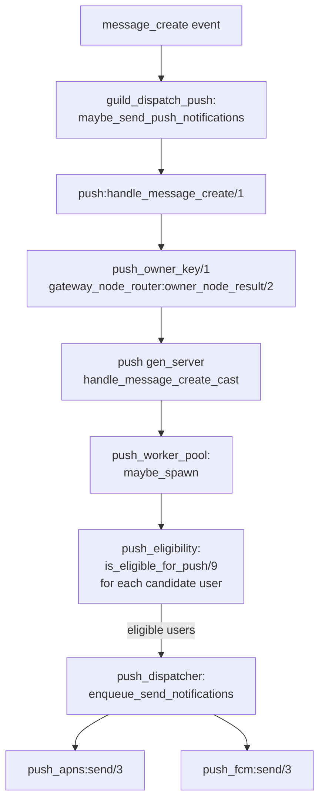

# Push Notifications

The push subsystem delivers APNs and FCM mobile notifications triggered by `message_create` events. It is activated when `GATEWAY_ROLE` is `push` or `all` (see [architecture-overview.md](architecture-overview.md)). The role-gated supervisor children are `push_dispatcher` and `push` (see [otp-supervision-tree.md](otp-supervision-tree.md)).

---

## Flow overview



The `guild_dispatch_push:maybe_send_push_notifications` call is one step in `process_dispatch/3`; see [event-dispatch-pipeline.md](event-dispatch-pipeline.md) for the full dispatch pipeline.

---

## `push` gen_server

**Module**: `push.erl`

`push` is a named `gen_server` (registered as `push`) that coordinates the notification pipeline for its assigned user set.

### Init sequence

1. `push_ets_cache:init()` — creates the four ETS tables (see [ETS cache](#push-ets-cache) below).
2. `push_worker_pool:init_counter()` — initialises the atomic counter used to track in-flight workers.
3. Reads `push_enabled` env boolean. If `false`, the eviction timer is not scheduled and a zero-TTL state is used.
4. `maybe_warn_vapid_misconfigured/1` — when `push_enabled=true`, reads `VAPID_PUBLIC_KEY` (`vapid_public_key`) and `VAPID_PRIVATE_KEY` (`vapid_private_key`). If either is missing or empty, logs an `error`-level message: _"push_enabled=true but VAPID keys are missing or empty; all web push notifications will be silently dropped"_.
5. Schedules the first eviction tick with `erlang:send_after(?EVICT_INTERVAL_MS, self(), evict_caches)` where `?EVICT_INTERVAL_MS = 60_000` ms.

State type:

```erlang
-type state() :: #{
    badge_counts_ttl_seconds := non_neg_integer(),
    max_entries := non_neg_integer()   %% default 500 000
}.
```

### Rendezvous routing

`push:handle_message_create/1` does not process the event locally. It calls `cast_to_push_owner/2`, which:

1. Calls `push_owner_key(Params)` → `push_message_params:owner_key(Params)` to extract the routing key (the user ID).
2. Calls `gateway_node_router:owner_node_result(Key, push)` to resolve the owning node via rendezvous hashing.
3. Casts the `{handle_message_create, Params}` message to the `push` gen_server on that node.

All push ETS lookups for a given user are therefore served from one node's cache, eliminating cross-node cache misses.

For details on rendezvous hashing and `gateway_node_router`, see [clustering-nats-rpc.md](../gateway/clustering-nats-rpc.md) (once authored).

### Worker pool

On receiving `{handle_message_create, Params}`, the gen_server calls `push_worker_pool:maybe_spawn(Fun)`. This spawns a short-lived process to run the eligibility loop and dispatch, returning `ok` or `dropped` when the pool is saturated. The worker runs `do_handle_message_create/2`, which:

1. Resolves the message context via `push_message_params:context/1`.
2. Calls `large_guild_metadata/1` once to fetch large-guild metadata for the guild (result shared across all candidate users for the same message).
3. Filters candidates with `push_eligibility:is_eligible_for_push/9`.
4. Calls `push_dispatcher:enqueue_send_notifications/9` for the eligible set.

### Eviction

Every 60 seconds the gen_server receives `evict_caches` and calls `push_ets_cache:evict_tables/1` with `max_entries = 500_000` per table, then reschedules.

---

## Eligibility: `push_eligibility:is_eligible_for_push/9`

**Module**: `push_eligibility.erl`

Signature:

```erlang
-spec is_eligible_for_push(
    UserId, AuthorId, GuildId, ChannelId,
    MessageData, GuildDefaultNotifications,
    UserRolesMap, ConnectedUsers, LargeGuildMetadata
) -> boolean().
```

The function returns `false` immediately when `UserId =:= AuthorId` (authors never receive their own push). Otherwise it applies two independent checks, both of which must pass:

| Check | Source |
|---|---|
| Author not blocked by user | `is_user_blocked/2` → `push_ets_cache:get_blocked_ids/1` |
| User guild settings allow notification | `check_user_guild_settings/8` |

`check_user_guild_settings/8` proceeds as:

1. Fetches per-user per-guild settings from `push_ets_cache:get_user_guild_settings/2`, falling back to `push_subscriptions:fetch_and_cache_user_guild_settings/2` on a cache miss.
2. If `mobile_push` setting is `false`, returns `false` immediately.
3. Delegates to `push_eligibility_checks:check_muted_and_notifications/9`, which evaluates:
   - Whether the guild or channel is muted.
   - The effective notification preference (`message_notifications`): `2` = no messages, `1` = only mentions, anything else = all messages.
   - For mentions-only preference, whether the user is actually mentioned (direct mention, role mention, `@everyone`, or `@here` when the user is connected).
   - For `@here`, the user is considered connected only if present in the `ConnectedUsers` map — suppressing push for active desktop sessions.
   - Large-guild metadata checks (passed in as `LargeGuildMetadata`).

`should_allow_notification/6` handles the preference branching:

- `?MESSAGE_NOTIFICATIONS_NO_MESSAGES (2)` → always `false`.
- `?MESSAGE_NOTIFICATIONS_ONLY_MENTIONS (1)` → `true` for DMs; otherwise checks `is_user_mentioned/5`.
- Any other value → `true`.

`is_user_mentioned/5` evaluates `@everyone`/`@here` (with `suppress_everyone` setting), direct user mentions, and role mentions (with `suppress_roles` setting).

---

## `push_dispatcher`

**Module**: `push_dispatcher.erl`

`push_dispatcher` is a `gen_server` that owns a bounded worker pool for sending notifications. It is started before `push` in the supervision tree.

### State

```erlang
-type state() :: #{
    queue        := queue:queue(push_job()),
    queued       := non_neg_integer(),
    inflight     := non_neg_integer(),
    workers      := #{reference() => true},
    max_inflight := pos_integer(),   %% default 256, capped by HTTP client budget
    max_queue    := pos_integer()    %% default 10 000
}.
```

`max_inflight` is the smaller of the configured `push_dispatcher_max_inflight` and the budget derived from `gateway_http_client:push_max_concurrency() div push_subscriptions:delivery_concurrency()`.

### Enqueue contract

```erlang
-spec enqueue_send_notifications(...) -> ok | dropped.
```

- `ok` — job was started immediately or queued.
- `dropped` — the queue is full (`queued >= max_queue`); the job is discarded and a `warning` log is emitted with a running drop counter.

Jobs are `push_job()` maps with `type = message_create` or `type = clear_channel`.

When a worker finishes (its monitor fires `'DOWN'`), `drain_queue` starts the next queued job if capacity allows.

### Job execution

Each worker calls `push_sender:send_push_notifications/1`, which iterates the eligible user IDs, looks up subscriptions, and dispatches to `push_apns:send/3` or `push_fcm:send/3` based on subscription type.

---

## APNs delivery: `push_apns`

**Module**: `push_apns.erl`

```erlang
-spec send(UserId :: integer(), Subscription :: map(), Payload :: map()) ->
    false | {true, map()}.
```

Returns `false` if APNs is disabled (`apns_enabled` env is not `true`).

### Flow

1. Extracts fields from `Subscription`: `endpoint` (device token), `subscription_id`, `app_id` (defaults to `<<"stable">>`), `provider_environment` (defaults to `apns_default_environment` env var, normalised to `<<"production">>` or `<<"development">>`).
2. Builds an RPC request map with `type = send_apns_push` and the extracted fields.
3. Calls `rpc_client:call(Request)` to send via the API RPC layer (not direct HTTP/2 from the gateway).
4. Handles the response:
   - `#{<<"success">> := true}` → `false` (no further action).
   - `#{<<"should_delete">> := true}` → `{true, DeletePayload}` — signals the caller to delete the stale subscription.
   - Any other response or error → `false`, with a `debug` log on error.

---

## FCM delivery: `push_fcm`

**Module**: `push_fcm.erl`

```erlang
-spec send(UserId :: integer(), Subscription :: map(), Payload :: map()) ->
    false | {true, map()}.
```

Returns `false` if FCM is disabled (`fcm_enabled` env is not `true`).

### Flow

1. Extracts `endpoint` (device token), `subscription_id`, `app_id` from `Subscription`.
2. Resolves the FCM project ID: checks the `fcm_apps` list for a matching `app_id`, falls back to `fcm_project_id` env var.
3. Resolves an OAuth2 access token via `resolve_access_token/0`:
   - Reads service account credentials from `fcm_service_account_json_path` JSON file (or individual env vars `fcm_client_email`, `fcm_private_key`, `fcm_private_key_path`).
   - Checks `push_token_cache` for a valid cached token (with a 60-second skew margin).
   - On cache miss, signs a JWT (RS256) with the service account private key and exchanges it at the token URI for a bearer token, caching the result.
4. Builds the FCM v1 message via `push_fcm_payload:build_message/2`.
5. POSTs to `https://fcm.googleapis.com/v1/projects/{project_id}/messages:send` with a `Bearer` token header using `gateway_http_client:request/6`.
6. Delegates response handling to `push_fcm_payload:handle_response/3`.

---

## `push_ets_cache`

**Module**: `push_ets_cache.erl`

Owns four named public ETS tables, all created with `{read_concurrency, true}, {write_concurrency, true}`.

| Table atom | Key | Value | Purpose |
|---|---|---|---|
| `push_user_guild_settings` | `{UserId, GuildId}` | `map()` | Per-user per-guild notification settings |
| `push_subscriptions` | `UserId` | `list()` | Push subscription records (APNs/FCM/web) |
| `push_blocked_ids` | `UserId` | `[integer()]` | Users blocked by this user |
| `push_badge_counts` | `UserId` | `{Count, CachedAt}` | Cached unread badge counts |

### LRU eviction

Eviction is triggered in two ways:

1. **Periodic**: the `push` gen_server sends `evict_caches` every 60 seconds, calling `evict_tables/1` with `max_entries = 500_000` per table.
2. **Guard on write**: `guard_table_size/1` is called before every insert. If the table has reached 500 000 entries, it evicts a batch of 4 096 entries (`?EVICT_BATCH`) before inserting.

`evict_table/2` walks the table from `ets:first/1` and deletes entries until `size - max_entries` records have been removed. This is insertion-order approximation rather than true LRU, but it bounds memory under load.

### Badge count writes

`put_badge_count/3` uses `ets:insert_new` first, then falls back to `ets:select_replace` with a guard that only replaces if the stored `CachedAt` is not newer. This prevents stale out-of-order writes from overwriting fresher data.

### Rebalance

`rebalance/0` (and its async variant) scans all four tables and deletes entries whose owner key resolves to a different node via `gateway_node_router:owner_node_result/2`. This is called after cluster membership changes to shed data that has migrated to another node.

---

## VAPID key configuration

VAPID keys are used for web push subscriptions (RFC 8292). The gateway reads two env vars at startup:

| Env var | Config key | Purpose |
|---|---|---|
| `VAPID_PUBLIC_KEY` | `vapid_public_key` | Identifies the application server to browser push services |
| `VAPID_PRIVATE_KEY` | `vapid_private_key` | Signs the VAPID JWT sent with each web push request |

Both must be non-empty binaries when `push_enabled=true`. Missing or empty keys result in a startup `error` log. Web push notifications are silently dropped until valid keys are configured; APNs and FCM delivery is not affected.

---

## Presence interaction

When a user's session is connected, `push_buffer` in presence state defers notifications rather than delivering them. When the session disconnects the buffer is flushed. See [presence-subsystem.md](presence-subsystem.md) for details on `push_buffer` and its flush lifecycle.
