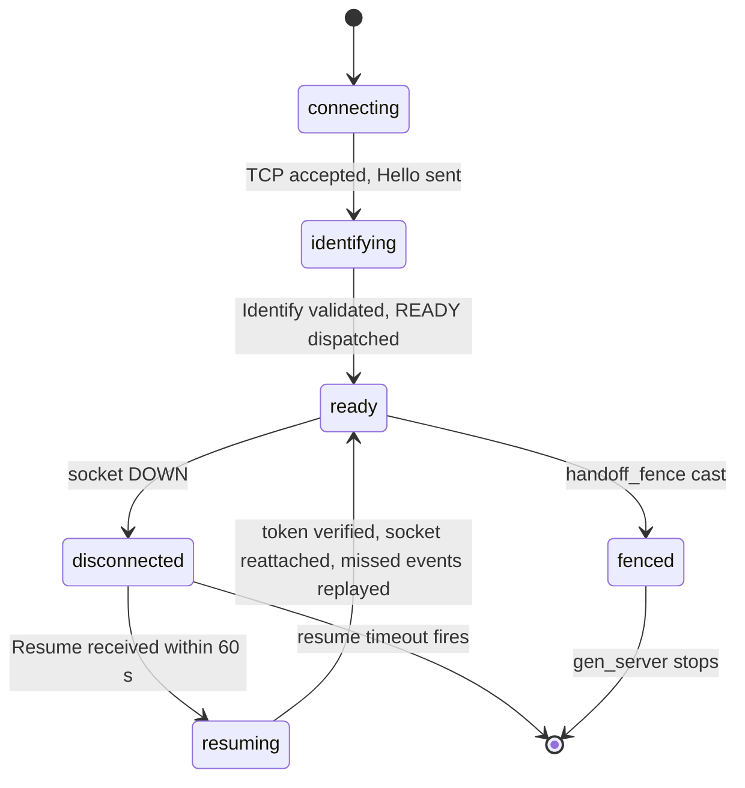

# Session Lifecycle

A Session is a single authenticated client connection represented by a `gen_server` process (`session.erl`). It holds per-connection state, drives event delivery, manages resume, and coordinates with the Presence and Guild processes for the duration of the connection.

See [architecture-overview.md](architecture-overview.md) for where Sessions fit in the overall topology, [otp-supervision-tree.md](otp-supervision-tree.md) for how `session_manager` is supervised, and [websocket-handler.md](websocket-handler.md) for how the WebSocket handler creates and drives a Session.

## State diagram



## Session creation from Identify

When a client sends opcode `identify` (2), `gateway_handler_identify` handles it:

1. Validates the token against the auth service.
2. Generates a 16-byte random session ID (`?random_session_bytes = 16` from `constants.erl`; hex-encoded as a 32-character binary).
3. Calls `session_manager:start/2` with the assembled request map and the socket `pid`.
4. `session_manager` routes the call to the owning shard via `session_manager_routing:call_owner_manager/3`.
5. The owning shard starts `session.erl` under its supervisor via `gen_server:start_link/3`.
6. `session_init:build_state/1` builds the initial state map from the request.
7. Back in `session_init:extract_core_fields/9`, `monitor(process, SocketPid)` sets up the socket monitor; the resulting reference is stored in `socket_mref`.
8. `session_init:schedule_timers/1` sends `{presence_connect, 0}`, `{guild_connect, GuildId, 0}` for each guild, and schedules the `check_ack_lag` periodic (60 000 ms).

## Session state fields

The `session_state()` type is defined in `session.erl`. Key fields:

| Field | Type | Description |
|---|---|---|
| `id` | `binary()` | 32-char hex session ID, generated on Identify |
| `user_id` | `integer()` | Authenticated user ID |
| `token_hash` | `binary()` | SHA hash of the auth token; used for resume verification |
| `auth_session_id_hash` | `binary()` | Hash of the auth session ID; used for `terminate` calls |
| `seq` | `non_neg_integer()` | Sequence number of the last event sent to the client |
| `ack_seq` | `non_neg_integer()` | Sequence number of the last event the client acknowledged via heartbeat |
| `buffer` | `limited_deque:deque() \| [map()]` | Replay buffer of unacknowledged events |
| `buffer_bytes` | `non_neg_integer()` | Tracked byte size of the buffer |
| `status` | `status()` | Current presence status (`online \| offline \| idle \| dnd \| invisible`) |
| `socket_pid` | `pid() \| undefined` | The `gateway_handler` process for the active WebSocket connection |
| `socket_mref` | `reference() \| undefined` | Monitor reference for `socket_pid` |
| `guilds` | `#{guild_id() => guild_ref()}` | Map of guild IDs to `{pid, ref}` tuples (or `undefined`, `cached_unavailable`, `unavailable`) |
| `active_guilds` | `sets:set(guild_id())` | Guild IDs for which the session has active subscriptions |
| `presence_pid` | `pid() \| undefined` | The `presence` gen_server for this user |
| `presence_mref` | `reference() \| undefined` | Monitor reference for `presence_pid` |
| `bot` | `boolean()` | Whether the session belongs to a bot user |
| `shard` | `{shard_id, num_shards} \| undefined` | Client shard tuple from Identify |
| `e2ee_capable` | `boolean()` | Whether the client supports end-to-end encryption |
| `fenced` | `boolean()` | Set to `true` when the session has been handed off and must not release cluster resources on termination |
| `resume_timer` | `{token, reference()} \| undefined` | Active resume-timeout timer; the token guards against stale firings |
| `offline_timer` | `{token, reference()} \| undefined` | Timer that moves presence to `offline` if the socket stays disconnected |

Additional fields include `user_data`, `custom_status`, `version`, `properties`, `afk`, `mobile`, `resume_status`, `channels`, `calls`, `ready`, `relationships`, `ignored_events`, `guild_subscription_state`, `collected_guild_states`, `collected_sessions`, `collected_presences`, `pending_presences`, `suppress_presence_updates`, `guild_connect_inflight`, `guild_connect_workers`, `voice_queue`, `debounce_reactions`, and `reaction_buffer`.

## Resume flow

When a client disconnects, the Session transitions to `disconnected`. A 60-second resume timer is started (constant `resume_timeout = 60 000 ms` from `constants.erl`). If the client reconnects and sends opcode `resume` (6) before the timer fires, `gateway_handler_identify` calls:

```
session:handle_call({resume, Seq, SocketPid})
```

This dispatches to `session_lifecycle:handle_resume/3`, which:

1. Rejects with `invalid_seq` if `Seq > CurrentSeq` or `Seq < AckSeq` (client claims a sequence outside the buffered window).
2. Converts the buffer to a list if it is still a `limited_deque`.
3. Calls `events_after_seq(Seq, BufferList)` to collect all buffered events with `seq > Seq`; these are the missed events.
4. Cancels the `resume_timer` and `offline_timer` via `cancel_resume_timer/1` and `cancel_offline_timer/1`.
5. Replaces the socket via `replace_socket/2`: demonitors the old socket reference, monitors the new `SocketPid`, and stores the new `socket_mref`. If the old socket is a different pid, it receives `session_reconnect` so the previous handler closes cleanly.
6. Restores `status` to `resume_status` (non-offline value) via `status_on_resume/2`.
7. Calls `ensure_presence_attached_on_resume/5`: if the presence attachment is healthy, notifies the presence gen_server of the reconnect via `notify_presence_on_resume/5`; if unhealthy, calls `force_presence_reconnect/1` which schedules `{presence_connect, 0}`.
8. Returns `{ok, MissedEvents, CurrentSeq}` to the handler; the handler dispatches each missed event and then sends `RESUMED`.

### Resume timeout

The timer message takes the form `{resume_timeout, Token}` where `Token` is the first element of the `resume_timer` tuple. On receipt, `do_handle_resume_timeout/2` checks that `socket_pid` is still `undefined` and that the token matches. A mismatch means a stale timer fired after a successful resume and is ignored. On timeout the gen_server stops normally.

## Event buffer

The replay buffer is a `limited_deque` bounded to **4 096 entries** and **16 MiB** total (`?MAX_EVENT_BUFFER_SIZE = 4096`, `?MAX_TOTAL_BUFFER_BYTES = 16_777_216` in `session_dispatch.erl`).

### limited_deque internals

`limited_deque` is a two-list deque (a `front` list and a `rear` list) wrapped in a map with `count`, `max_count`, `bytes`, and `max_bytes` fields. The `size/1` function reads `count` directly, making it O(1). The `bytes/1` function reads the tracked `bytes` field, also O(1).

`push/2` appends to `rear` and then calls `trim_front/1`. `trim_front/1` pops from the front until both `count <= max_count` and `bytes <= max_bytes` hold, evicting the oldest entries.

`drop_while_front/2` pops items from the front as long as the predicate returns `true`, then pushes the first non-matching item back. This is used to drop acknowledged events.

### How ack_seq drives buffer trimming

On `{heartbeat_ack, Seq}`, `session_lifecycle:handle_heartbeat_ack/2` calls:

```erlang
drop_acked_buffer(Seq, Buffer)
```

For a `limited_deque` buffer this calls:

```erlang
limited_deque:drop_while_front(fun(E) -> maps:get(seq, E) =< Seq end, Buffer)
```

All events at the front whose `seq <= Seq` are dropped. The new `ack_seq` is stored in state. Subsequent pushes into the buffer have the old acknowledged events removed, keeping the buffer bounded to unacknowledged events only.

Individual events larger than 2 MiB (`?MAX_SINGLE_EVENT_BUFFER_BYTES = 2_097_152`) are sent to the socket but not buffered; they are sent without replay. `GUILD_MEMBERS_CHUNK` events are also sent without buffering (`should_skip_replay_buffer/1`).

### Buffer during dispatch

`session_dispatch:handle_dispatch/3` increments `seq` and, for replayable events:

1. Converts a legacy `[map()]` buffer to a `limited_deque` on first use via `from_list/3`.
2. Calls `limited_deque:push(Request, Buffer)` where `Request = #{event, data, seq}`.
3. Updates `buffer_bytes` from `limited_deque:bytes/1`.
4. Sends the event to the socket.

## Session drain

Two drain mechanisms cause the session to signal its socket and eventually stop.

### reconnect_drain

A `reconnect_drain` cast (or `{reconnect_drain, SocketPid}` for targeted drain) is sent by `session_manager` during cluster handoff or rolling deploys. On receipt, `session_lifecycle:handle_reconnect_drain/1,2` sends `session_reconnect` to `socket_pid`. The `gateway_handler` receives this message, sends opcode `reconnect` (7) to the client, and closes the WebSocket. The session remains alive to accept a resume.

The targeted form `{reconnect_drain, SocketPid}` only signals the socket if `SocketPid =:= maps:get(socket_pid, State)`, preventing a stale drain from interrupting a socket that has already been replaced.

`session_manager:reconnect_drain/0` is guarded so that it only runs when `GATEWAY_ROLE` includes `websocket`. Nodes that handle only guilds or presence will not signal sockets they do not own.

### handoff_fence

The `handoff_fence` cast is sent during a cluster node handoff after the session state has been transferred to another node. `session_lifecycle:handle_handoff_fence/1`:

1. Sends `session_reconnect` to `socket_pid` (if set).
2. Sets `fenced => true` in state.
3. Returns `{stop, normal, State}`; the gen_server terminates immediately.

On termination, `session_lifecycle:terminate/2` calls `maybe_release_transferred_resources/1`. When `fenced` is `true` this function returns immediately without decrementing user session counts, disconnecting voice, or cleaning up presence; those resources now belong to the session on the receiving node.

## Presence attachment

`presence_pid` in session state points to the per-user `presence` gen_server. It is initially `undefined` and is populated by `session_connection_presence:handle_presence_connect/2`.

On `{presence_connect, Attempt}`:

1. `presence_manager:start_or_lookup/1` is called with a request containing `user_id`, `guild_ids`, `status`, `friend_ids` and `group_dm_recipients`.
2. On success, `gen_server:call(Pid, {session_connect, ...})` registers the session with the presence process.
3. The presence pid is monitored (`monitor(process, Pid)`) and stored as `{presence_pid, Pid}` and `{presence_mref, Ref}`.
4. The resulting sessions list is stored in `collected_sessions`.
5. On any failure, `schedule_presence_retry/2` backs off with jitter and retries up to 25 attempts (`?MAX_RETRY_ATTEMPTS`).

### Health check and repair

`session_connection_presence:presence_attachment_healthy/1` returns `true` when `presence_pid` is a live pid whose owning node matches the rendezvous-hash result for `user_id`. It returns `false` when:

- `presence_pid` is `undefined`.
- The pid is dead (local pid that is no longer alive).
- The pid's node differs from `gateway_node_router:owner_node_result(UserId, presence)`, indicating the cluster topology has changed.

`repair_presence_connection/1` calls `presence_attachment_healthy/1`; if `false`, it calls `force_presence_reconnect/1`, which demonitors the stale reference, clears `presence_pid` and `presence_mref`, and sends `{presence_connect, 0}` to self.

The `check_ack_lag` periodic (60 000 ms) and `{presence_rejoin_check}` messages both call `repair_presence_connection/1` to catch drift between heartbeat cycles.

On resume, `ensure_presence_attached_on_resume/5` performs the same health check. An unhealthy attachment schedules a reconnect rather than reusing the stale pid.

## serialize_state/1 vs serialize_transfer_state/1

Both functions are in `session_lifecycle.erl`.

### serialize_state/1

Used for the `{get_state}` call (e.g. admin RPC). Produces a safe wire representation suitable for external inspection:

- Includes `id`, `user_id` (as a binary string), `user_data`, `version`, `seq`, `ack_seq`, `properties`, `status`, `resume_status`, `afk`, `mobile`, `bot`, `shard`, `e2ee_capable`.
- Includes `guilds`, `active_guilds`, `collected_guild_states`, `collected_sessions`, `collected_presences`, `guild_subscription_state`.
- Includes `buffer` and `ready` as-is, but does not include `token_hash` or `auth_session_id_hash`.
- `user_id` is serialized as `integer_to_binary/1`.

### serialize_transfer_state/1

Used for the `export_state` call during cluster node handoff. Merges two sub-maps:

`serialize_transfer_identity/1`:
- All identity and configuration fields: `id`, `user_id` (integer), `user_data`, `custom_status`, `version`, `token_hash`, `auth_session_id_hash`, `properties`, `status`, `resume_status`, `afk`, `mobile`, `bot`, `shard`, `e2ee_capable`.
- `socket_pid` is always written as `undefined` (the new node must reattach its own socket).
- `guilds` is serialized as a normalized list of guild IDs via `session_init:normalize_guild_ids/1`.
- `ignored_events` is written as a key list.
- Also includes `initial_guild_id`, `active_guilds`, `debounce_reactions`.

`serialize_transfer_runtime/1`:
- `channels`, `relationships`, `seq`, `ack_seq`, `buffer` (the full replay buffer including all buffered events), `collected_guild_states`, `collected_sessions`, `collected_presences`, `guild_subscription_state`.

The receiving node rebuilds the `session_state()` from this map via `session_init:build_state/1`, restoring the buffer so that the resumed client can still receive missed events after handoff.
