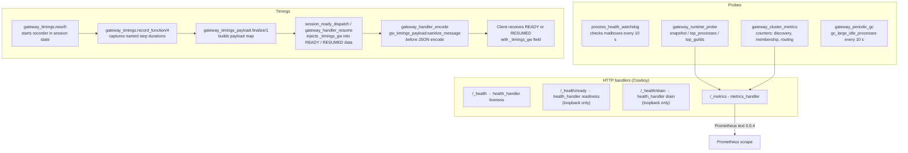

# 14. Telemetry

This document covers the observability layer of the gateway: HTTP health and metrics endpoints, runtime probes, process monitoring, per-request timing traces, Prometheus counter registrations, and periodic garbage collection.

Related documents: [otp-supervision-tree.md](otp-supervision-tree.md) (where `process_health_watchdog` and `gateway_periodic_gc` sit in the supervisor tree), [session-lifecycle.md](session-lifecycle.md) (where `gw_timings` is stored in session state), [clustering-nats-rpc.md](clustering-nats-rpc.md) (where `gateway_cluster_metrics` counters are incremented).

---

## Observability data flow



---

## HTTP endpoints

All four endpoints are registered in `fluxer_gateway_app:start_cowboy/0` on the single Cowboy listener that also serves WebSocket connections on `"/"`.

### `/_health`

- Handler: `health_handler`, mode `liveness`.
- No loopback check. Always returns `200 OK`.
- Used by load balancers that need a simple aliveness signal.
- Response headers include a `x-fluxer-build` version header from `gateway_build_info:version_headers/1`.

### `/_health/ready`

- Handler: `health_handler`, mode `readiness`.
- Loopback-only. Requests from any peer other than `127.0.0.1` or `::1` return `403 FORBIDDEN`.
- Calls `gateway_node_router:is_ready()`. Returns `200 OK` when ready or `503 DRAINING` when not.
- `is_ready/0` returns false when the node is draining (`persistent_term` flag `{fluxer_gateway, draining}` is set) or when `gateway_hotpatch_reconciler:is_ready()` is false. See [hot-patching.md](hot-patching.md) for the hotpatch readiness gate.

### `/_health/drain`

- Handler: `health_handler`, mode `drain`.
- Loopback-only. Non-loopback requests return `403 FORBIDDEN`.
- On a valid loopback request it calls `gateway_cluster_handoff:drain_async/0` and returns `200 DRAINING`.
- `drain_async/0` sets the `{fluxer_gateway, draining}` persistent term flag and triggers session and guild transfer to peer nodes. See [clustering-nats-rpc.md](clustering-nats-rpc.md) for the handoff mechanism.

### `/_metrics`

- Handler: `metrics_handler`.
- No loopback restriction; protect with network policy if needed.
- Returns Prometheus exposition format (`text/plain; version=0.0.4; charset=utf-8`).
- The response is assembled inline on each request  -  there is no background scrape buffer.

---

## `metrics_handler`  -  rendered metric groups

`render_metrics/0` concatenates six iolist sections:

| Section | Source | Metrics |
|---|---|---|
| Gateway gauges | `session_manager`, `guild_manager`, `voice_state_counts_cache`, `call_manager`, `push_worker_pool`, `gateway_concurrency` | `fluxer_gateway_sessions_total`, `fluxer_gateway_guilds_total`, `fluxer_gateway_voice_connections_total` (+ region/server labels), `fluxer_gateway_calls_total`, `fluxer_gateway_push_workers_active`, `fluxer_gateway_concurrent_session_starts`, `fluxer_gateway_concurrent_guild_starts` |
| Cluster counters | `gateway_cluster_metrics:snapshot/0` | `fluxer_gateway_cluster_member_count`, `fluxer_gateway_cluster_discovery_resolve_failures_total`, `fluxer_gateway_cluster_membership_transitions_total{direction="up"|"down"}`, `fluxer_gateway_cluster_owner_resolutions_total{result="self"|"peer"}` |
| Process counts | `process_registry_table` ETS scan | `fluxer_gateway_processes{type="guild"|"session"|"presence"|"call"|"voice"}` |
| Push dispatcher | `push_dispatcher:stats/0` | `fluxer_gateway_push_dispatcher_queued`, `fluxer_gateway_push_dispatcher_inflight` |
| Hotpatch | `gateway_hotpatch_reconciler:status/0` | `fluxer_gateway_hotpatch_enabled`, `fluxer_gateway_hotpatch_ready`, `fluxer_gateway_hotpatch_applied_events_total` |
| VM | `erlang:memory/0`, `erlang:system_info/1` | `erlang_vm_memory_bytes{type="total"|"processes"|"binary"|"ets"|"atom"}`, `erlang_vm_process_count`, `erlang_vm_port_count`, `erlang_vm_atom_count`, `erlang_vm_scheduler_count` |

All subsystem calls are wrapped in `safe_apply_*` helpers that return a zero-value default if the subsystem is not running (e.g. when `GATEWAY_ROLE` omits guilds or push). See [architecture-overview.md](architecture-overview.md) for role values.

---

## `gateway_runtime_probe`  -  runtime introspection

`gateway_runtime_probe` is a pure-function module (no `gen_server`). It is not called by `metrics_handler` directly but is available for diagnostic RPC calls and admin tools.

### `snapshot/0`

Returns a map with:

| Key | Source |
|---|---|
| `node` | `node()` |
| `memory` | `erlang:memory()`  -  proplist of memory type totals |
| `process_count` | `erlang:system_info(process_count)` |
| `run_queue` | `erlang:statistics(run_queue)` |
| `scheduler_wall_time` | `erlang:statistics(scheduler_wall_time)`  -  `unavailable` if not enabled |
| `reductions` | `erlang:statistics(reductions)` |

### `top_processes(Metric, Limit)`

Scans up to 5 000 processes (`?MAX_PROCESS_SCAN`), enriches each with `erlang:process_info/2` fields (`memory`, `message_queue_len`, `reductions`, `current_function`, `initial_call`, `registered_name`, `total_heap_size`, `heap_size`, `stack_size`, `garbage_collection`), sorts descending by `Metric`, and returns at most `min(Limit, 100)` rows.

Valid metric atoms: `memory | message_queue_len | reductions | total_heap_size`. Any other value defaults to `memory`.

### `sample_processes(Milliseconds, Limit)`

Captures a reduction snapshot across the process scan set, waits `Milliseconds` (clamped to 10–5 000 ms, default 250 ms when invalid), captures again, computes the delta per process, and returns the top N by reduction delta. Processes with a delta of zero are excluded.

### `top_guilds(Limit)`

Reads the `guild_pid_cache` ETS table (max 5 000 entries via a bounded `ets:select`), fetches basic info for each local guild pid, and returns the top N by memory. Each row includes `guild_id`, `guild_name`, `member_count`, `session_count`, `presence_count` alongside standard process info. The guild name and counts come from `sys:get_state/2` with a 50 ms timeout.

### `sample_guilds(Milliseconds, Limit)`

Same pattern as `sample_processes` but restricted to guild processes from `guild_pid_cache`. Rows include the full guild info fields plus `reduction_delta`.

### `guild_probe(GuildId)`

Looks up a single guild by integer ID via `guild_manager:lookup/1`. On success returns the same enriched row as `top_guilds`. On error or process-not-found returns a minimal map with `guild_id` and a `lookup` error field.

---

## `process_health_watchdog`  -  mailbox monitoring

`process_health_watchdog` is a `gen_server` started unconditionally in the supervisor. It runs a check every `10 000 ms` (`?CHECK_INTERVAL_MS`).

### Monitored processes

Each check collects two groups:

1. Guild processes  -  all local PIDs from `guild_pid_cache` ETS (max 5 000), labelled `"guild:<id>"`.
2. Singleton processes  -  named processes resolved with `whereis/1`: `session_manager`, `presence_manager`, `guild_manager`, `call_manager`, `push_dispatcher`, `push`, `gateway_nats_rpc`, `gateway_nats_pool`, `gateway_dispatch_relay`, `gateway_rollout_config`.

### Thresholds and actions

The watchdog records a rolling window of up to 3 mailbox length samples per PID (`?STUCK_CONSECUTIVE_GROWTH = 3`).

| Mailbox length | Action |
|---|---|
| > 1 000 (`?WARNING_THRESHOLD`) | `logger:warning` |
| > 10 000 (`?CRITICAL_THRESHOLD`) | `logger:critical` + major GC on the process |
| > 50 000 (`?KILL_THRESHOLD`) | `logger:critical` + major GC; if the last 3 samples are all > 50 000 and strictly increasing (i.e. the queue is growing), `exit(Pid, kill)` |
| Monotonically growing across 3 checks (oldest > 1 000) | `logger:warning` "Stuck process detected" |

Dead PIDs are pruned from the history map each cycle.

---

## `process_liveness`  -  liveness checks

`process_liveness` is a pure-function module with two exported functions:

**`is_alive(Pid)`**  -  returns `true` if the PID is alive.
- For local PIDs: `erlang:is_process_alive/1`.
- For remote PIDs: `rpc:call/5` to the owning node with a 1 000 ms timeout. Returns `false` if the node is not in `nodes()` or the RPC times out.

**`are_alive(Pids)`**  -  batches liveness checks. Local PIDs are checked directly. Remote PIDs are checked concurrently via spawned probes, each with a 1 500 ms gather timeout. Returns `#{Pid => boolean()}`.

`process_liveness` is used by `process_registry:registry_whereis/1` to validate that a registered PID is still alive before returning it, and by `process_registry:get_count/1` to count only live processes in a process map.

---

## `process_memory_stats`  -  guild memory ranking

`process_memory_stats` provides `get_guild_memory_stats(Limit)`, which returns a sorted list of `guild_stats()` maps for the top-N guilds by memory usage.

The function:

1. Tries to get guild PIDs from `guild_pid_cache` ETS (fast path). Falls back to scanning up to 5 000 processes and matching those whose `$initial_call` dictionary entry resolves to the `guild` module.
2. Sorts candidates by memory descending.
3. Fetches state from the top candidates via `sys:get_state/2` (100 ms timeout), capped at `?MAX_STATE_FETCH = 200` attempts.
4. Builds `guild_stats()` maps: `guild_id`, `guild_name`, `guild_icon`, `memory`, `member_count`, `session_count`, `presence_count`.

Limit is clamped to 1–100 (default 20).

---

## `process_registry`  -  named process ETS table

`process_registry` owns the `process_registry_table` ETS table (`named_table, public, set, read_concurrency`). The table stores `{process_key(), pid()}` entries where `process_key()` is `{atom(), integer() | binary()}`.

Supported prefix atoms: `call`, `channel`, `guild`, `presence`, `session`, `session_group`, `voice`.

Key operations:

| Function | Behaviour |
|---|---|
| `init/0` | Creates the ETS table if absent (idempotent) |
| `register_and_monitor(Key, Pid, Map)` | `ets:insert_new`; if a collision occurs, force-stops the new process and re-monitors the existing one |
| `registry_whereis(Key)` | Looks up the table and validates liveness via `process_liveness:is_alive/1`; removes stale entries |
| `lookup_or_monitor(Key, MapKey, Map)` | Finds an existing registration and monitors it into the caller's process map |
| `cleanup_on_down(DeadPid, Map)` | Filters dead PID entries from a process map on `'DOWN'` messages |
| `safe_unregister(Key, Pid)` | `ets:delete_object`  -  removes only the exact `{Key, Pid}` pair |
| `get_count(Map)` | Counts live entries using `process_liveness:are_alive/1` |

`process_registry` is initialised in `fluxer_gateway_app:init_subsystems/0` before the supervisor starts.

---

## `gateway_timings`  -  per-request trace recorder

`gateway_timings` implements a lightweight trace recorder that accumulates named step durations across the lifetime of a session identify or resume operation. The recorder is stored in session state under the key `gw_timings`.

### Recorder type

```erlang
-type recorder() :: #{
    started_at_us := integer(),   % erlang:monotonic_time(microsecond)
    started_node  := node() | undefined,
    steps         := map(),       % named step durations
    nodes         := [map()],     % remote node hits
    trace         := [map()],     % ordered span list
    pod_name      := binary()
}.
```

### Key functions

**`new/0`**  -  creates a recorder with `started_at_us` set to `erlang:monotonic_time(microsecond)` and `pod_name` from the `POD_NAME` or `HOSTNAME` env var (fallback: `inet:gethostname()`).

**`record_function(StepName, FunctionName, StartedAtUs, Recorder)`**  -  computes `elapsed_us(StartedAtUs)` and stores a step entry. If the same step name is recorded multiple times, durations are summed and `min_us`/`max_us`/`count` are maintained.

**`record(Name, StartedAtUs, Recorder)`**  -  shorthand where step name and function name are the same.

**`span(FunctionName, StartedAtUs)`**  -  returns a span map without recording it into the recorder; used to build child spans.

**`merge(Recorder0, Recorder1)`**  -  merges steps, nodes and trace lists from two recorders; used when a remote node returns timing data.

**`record_node_hit(Role, Node, Recorder)`**  -  records a remote node entry if `Node =/= node()`.

**`record_api_node_from_session_result(Result, Recorder)`**  -  extracts `_timings` from an API call result and merges it as an `"api"` node entry.

**`finalize(Recorder)`**  -  produces the final payload map: `#{unit => "microseconds", total_us, pod_name, trace}`. `total_us` is the sum of trace span durations if the trace is non-empty, otherwise the elapsed time since `started_at_us`.

**State helpers:**
- `from_state(State)`  -  extracts `gw_timings` from a session state map; returns `new()` if absent or invalid.
- `put_state(Recorder, State)`  -  writes `gw_timings` back into session state.
- `merge_state(Update, State)`  -  merges a recorder into the one already stored in session state.

---

## `gateway_timings_payload`  -  `_timings_gw` field in READY/RESUMED

`gateway_timings_payload` handles the final serialisation and sanitisation of timing data sent to the client.

**`finalize(Recorder)`**  -  like `gateway_timings:finalize/1` but with the sanitisation pipeline applied. Reverses the trace list (so spans are in chronological order), sanitises each span (normalises name, duration, optional remote and children fields), and builds the payload map.

**`sanitize(Timings)`**  -  takes an already-finalised timing map (e.g. one received over the wire from a remote node) and re-normalises it. Used when a partially finalised recorder is passed across cluster nodes before the final encoding step.

**`sanitize_message(Message)`**  -  called by `gateway_handler_encode:encode_and_compress/2` on every outbound WebSocket message. For `READY` and `RESUMED` dispatch events (opcode 0) that contain `_timings_gw` in their data map, the function replaces the value with a sanitised copy. All other messages pass through unchanged.

### How `_timings_gw` reaches the client

1. `gateway_timings:new/0` is called at the start of the identify or resume flow and the recorder is stored in session state via `put_state/2`.
2. Throughout the identify/resume pipeline, `record_function/4` and `merge_state/2` accumulate step durations.
3. On `READY`: `session_ready_dispatch` calls `gateway_timings_payload:finalize/1` and injects the result into the ready data map as `_timings_gw`.
4. On `RESUMED`: `gateway_handler_resume:put_resumed_gateway_timings/1` calls `gateway_timings_payload:finalize/1` and returns a map with `_timings_gw`.
5. Before JSON encoding, `gateway_handler_encode` calls `gateway_timings_payload:sanitize_message/1`, which re-validates and normalises the `_timings_gw` field.
6. The client receives the `READY` or `RESUMED` payload with `_timings_gw` containing `unit`, `total_us`, `pod_name`, and a `trace` array of named spans.

---

## `gateway_cluster_metrics`  -  Prometheus counter registrations

`gateway_cluster_metrics` uses the Erlang `counters` module to maintain atomic, write-concurrent counters in a `persistent_term` entry keyed by `gateway_cluster_metrics_counters`.

`init/0` is called in `fluxer_gateway_app:init_subsystems/0`. It creates the counter array if absent.

### Counters

| Index | Key in `snapshot/0` | Incremented by |
|---|---|---|
| 1 `?DISCOVERY_RESOLVE_FAILURES_IDX` | `gateway_cluster_discovery_resolve_failures_total` | `record_discovery_resolve_failure/0` |
| 2 `?MEMBERSHIP_UP_IDX` | `gateway_cluster_membership_transitions_total{up}` | `record_membership_transition(up)` |
| 3 `?MEMBERSHIP_DOWN_IDX` | `gateway_cluster_membership_transitions_total{down}` | `record_membership_transition(down)` |
| 4 `?OWNER_SELF_IDX` | `gateway_node_router_owner_resolutions_total{self}` | `record_owner_resolution(self)` |
| 5 `?OWNER_PEER_IDX` | `gateway_node_router_owner_resolutions_total{peer}` | `record_owner_resolution(peer)` |

`snapshot/0` also calls `gateway_cluster_membership:alive_count/0` for the `gateway_cluster_member_count` gauge (this is not a counter  -  it reflects current live member count directly).

`metrics_handler` calls `gateway_cluster_metrics:snapshot/0` on every `/_ metrics` scrape and renders the results under the `fluxer_gateway_cluster_*` and `fluxer_gateway_node_router_*` namespaces. See the cluster counters table in the `metrics_handler` section above.

---

## `gateway_periodic_gc`  -  major GC trigger and health checks

`gateway_periodic_gc` is a `gen_server` started unconditionally in the supervisor alongside `process_health_watchdog`. It runs two independent timers:

### GC cycle  -  every 10 000 ms (`?GC_INTERVAL_MS`)

`gc_large_idle_processes/0` scans up to 5 000 processes. For each process with an empty mailbox and memory above a threshold, it checks the `$initial_call` process dictionary entry and forces a major GC if the process matches a known large-process type:

| Module | Threshold | GC trigger |
|---|---|---|
| `guild_broadcaster` | 64 MiB (`?LARGE_BROADCASTER_BYTES`) | `erlang:garbage_collect(Pid, [{type, major}])` |
| `guild` | 256 MiB (`?LARGE_GUILD_BYTES`) | `erlang:garbage_collect(Pid, [{type, major}])` |

Only idle processes (mailbox length 0) are targeted so that GC does not interfere with active message processing.

The GC cycle also checks NATS connection health: it inspects the `gateway_nats_pool` slot map, and for any connection with a mailbox length above 5 000 (`?NATS_MQL_THRESHOLD`) it tracks a backlog counter. If the backlog persists for 3 consecutive cycles (`?NATS_SUSTAINED_CYCLES`), the connection is gracefully stopped (`exit(Pid, shutdown)` with a 2 s wait, then `exit(Pid, kill)`).

### Health check cycle  -  every 30 000 ms (`?HEALTH_INTERVAL_MS`)

`reap_stuck_spawns/1` looks for spawned processes (initial call `{erlang, apply, 2}`) that are stuck in a known blocking call with a non-empty mailbox (> 100, `?STUCK_PROC_MQL_THRESHOLD`) and zero reduction progress. Known stuck call patterns:

- `gen:do_call`
- `prim_inet:recv0`
- `gen_statem:call_clean`

If such a process shows no reduction progress across 3 consecutive checks (`?STUCK_SUSTAINED_CYCLES`), it is gracefully stopped.

`reset_drifted_counters/0` also fires on this cycle. It reads the `gateway_concurrency` counter pair for concurrent session and guild starts and resets either counter to zero if it has drifted negative or above twice the configured maximum.

---

## Startup sequence

1. `fluxer_gateway_app:init_subsystems/0` calls `gateway_cluster_metrics:init/0` and `process_registry:init/0` before the supervisor starts.
2. `fluxer_gateway_sup` starts `process_health_watchdog` and `gateway_periodic_gc` as always-on common children (see [otp-supervision-tree.md](otp-supervision-tree.md)).
3. `start_cowboy/0` registers all four HTTP routes. Both `/_health/ready` and `/_health/drain` silently return `403` to any non-loopback caller.
