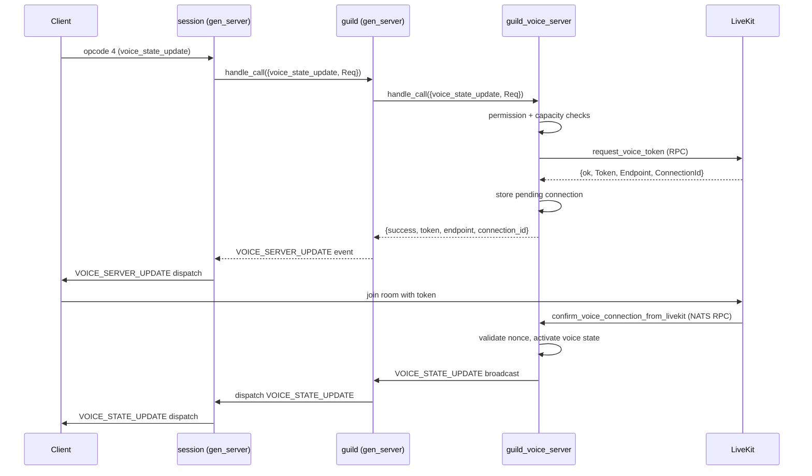

# Voice

The voice subsystem handles guild voice channels and DM voice calls. Guild voice is coordinated through a per-guild `guild_voice_server` gen_server linked to the guild process. DM voice routes through the `call_manager` subsystem instead. Both ultimately rely on LiveKit for media transport, with the gateway acting as the control plane.

## `guild_voice_server` gen_server

Each guild process starts a `guild_voice_server` linked to it during `guild_init:init_voice_server`. The voice server is a separate gen_server registered in the `guild_voice_registry` ETS table keyed by guild ID.

### State

```erlang
-type server_state() :: #{
    guild_id          := integer(),
    guild_pid         := pid(),
    voice_states      := voice_state_map(),          %% keyed by connection_id binary
    pending_voice_connections := map(),              %% keyed by connection_id binary
    recently_disconnected_voice_states := map(),     %% keyed by connection_id binary
    e2ee_room_keys    := map()                       %% keyed by channel_id integer
}.
```

`voice_states` is the authoritative map of active voice connections. Each entry is keyed by the connection ID (a binary) and holds a map with user ID, channel ID, guild ID, server ID, region ID, session ID, mute/deaf/video flags and `e2ee_capable`.

`pending_voice_connections` holds connections that have been issued a token but not yet confirmed by LiveKit. The map is bounded at `1000` entries. Pending entries carry a `created_at` and `expires_at` timestamp; entries older than 300 000 ms (5 minutes) are swept by the periodic `sweep_pending_joins` timer.

`recently_disconnected_voice_states` caches voice states for up to 120 000 ms after disconnect so that a fast LiveKit reconnect can restore the state without a full rejoin. The cache is bounded at `500` entries.

`e2ee_room_keys` maps channel ID to the current room encryption key for E2EE channels. The map is bounded at `1000` entries.

### Registry and lookup

The server registers itself in `guild_voice_registry` on init and deletes its entry on terminate. `guild_voice_server:lookup/1` first checks the ETS registry, then falls back to querying the guild process via `get_voice_server_pid`. If the owning node is remote, `resolve_result/2` performs an RPC to the owner node.

### Periodic maintenance

Two timers run on `guild_voice_server`:

- `sweep_pending_joins` fires every 10 000 ms. It calls `guild_voice_connection:sweep_expired_pending_joins/1` to remove stale pending entries, and also evicts stale entries from `recently_disconnected_voice_states` and `e2ee_room_keys`.
- `voice_reconcile_v3_tick` fires on the interval configured by `gateway_rollout_config:voice_reconciliation_v3_interval_ms()` (default 2 000 ms with per-process jitter). See [Reconciliation](#voice-reconciliation-v3).

The voice server terminates when its linked guild process exits.

## Voice connection lifecycle

### Opcode 4: `voice_state_update`

A client sends opcode 4 (`voice_state_update`) to join, update, or leave a voice channel. The frame is handled by `gateway_handler_voice`, which dispatches to:

1. `session:handle_call({voice_state_update, Request})` on the session gen_server.
2. The session forwards to `guild:handle_call({voice_state_update, Request})`.
3. The guild's `handle_call` routing table maps this to `guild_voice_handler`, which calls into `guild_voice_server` via `gen_server:call`.
4. `guild_voice_server` delegates to `guild_voice:voice_state_update/2`, which calls `guild_voice_connection:voice_state_update/2`.

`guild_voice_connection:voice_state_update/2` inspects `channel_id` in the request:

- `null` — disconnect path via `guild_voice_disconnect:handle_voice_disconnect/5`.
- A channel ID with no existing `connection_id` in the request — new connection via `guild_voice_connection_join:handle_new_connection/5`.
- A channel ID with an existing `connection_id` — update path via `guild_voice_connection_update:handle_update_connection/6`.

### Permission check

Before any new connection is created, `guild_voice_connection_join` calls `guild_voice_permissions:check_voice_permissions_and_limits/6`. This checks in order:

1. Timeout: member must not be communication-timed-out.
2. Permissions: member must have `view_channel` (bit 1 024) and `connect` (bit 1 048 576) on the channel, unless they have virtual channel access or a move is pending.
3. Capacity: user count in the channel must be below the channel's `user_limit`.
4. Connection limit: user's active plus pending connections in the channel must be below the channel's `voice_connection_limit` (default 5, max 100).

See [permissions.md](permissions.md) for the permission calculation pipeline.

### Pending connection

When permission checks pass, `guild_voice_connection_join` requests a token from the LiveKit token service via `guild_voice_connection_token:request_voice_token/8`. A pending connection entry is stored in `pending_voice_connections` with the connection ID, user ID, channel ID, voice state snapshot, token nonce, `created_at`, and `expires_at` (30 000 ms TTL).

The reply sent back through the guild to the session contains:

```
#{success => true, token => Token, endpoint => Endpoint, connection_id => ConnectionId, voice_state => VoiceState}
```

The session then dispatches a `VOICE_SERVER_UPDATE` event to the client. The client connects to the LiveKit endpoint using the provided token.

### LiveKit confirmation

When the client successfully joins the LiveKit room, LiveKit signals the gateway via a NATS RPC call. The RPC is routed to the voice server as `{confirm_voice_connection_from_livekit, Request}`. The handler `guild_voice_connection_confirm:confirm_voice_connection_from_livekit/2`:

1. Looks up the connection ID in `pending_voice_connections`.
2. Validates the token nonce and expiry against the pending entry.
3. Resolves the final voice state from the pending data.
4. Removes the entry from `pending_voice_connections`.
5. Inserts the voice state into `voice_states`.
6. Clears virtual access flags.
7. Broadcasts `VOICE_STATE_UPDATE` to guild sessions via `guild_voice_broadcast:broadcast_voice_state_update/3`.

If no pending entry exists but the connection ID is already in `voice_states`, the confirm is treated as a no-op success. If the connection ID appears in `recently_disconnected_voice_states` and was disconnected within 60 000 ms, the voice state is restored from the cache and reactivated.

### Sequence diagram



### Disconnect

A client sends opcode 4 with `channel_id: null` to leave voice. `guild_voice_disconnect:handle_voice_disconnect/5` is called with the connection ID, session ID and user ID. The handler:

1. Removes matching voice state entries from `voice_states`.
2. Removes matching pending connection entries from `pending_voice_connections`.
3. Caches removed voice states in `recently_disconnected_voice_states`.
4. Issues a force-disconnect RPC to LiveKit for each removed active connection.
5. Broadcasts `VOICE_STATE_UPDATE` with `channel_id: null` to guild sessions.

`disconnect_voice_user_if_in_channel` handles the case where a force-disconnect must only take effect if the user is still in a specific channel, and caches the state for potential reconnect restoration.

`disconnect_all_voice_users_in_channel` removes every voice state for a given channel ID.

## E2EE

End-to-end encryption for voice is managed in `guild_voice_e2ee.erl`. E2EE uses a per-channel room key that is generated on demand and rotated when a channel becomes idle.

### `e2ee_capable` flag

The session state carries an `e2ee_capable` boolean (see [session-lifecycle.md](session-lifecycle.md)). When the client sends opcode 4, `e2ee_capable` is extracted from the request into the connection context. For guild voice the effective value is `context_e2ee_capable_guild/2`:

```erlang
maps:get(e2ee_capable, Context, false) andalso is_e2ee_enabled_for_guild(GuildState)
```

E2EE is enabled for a guild when the rollout scope is `platform_wide`, or when the guild has the `VOICE_E2EE` feature flag.

### Channel E2EE state

A channel is considered E2EE active (`channel_is_e2ee_active/2`) when every voice state in that channel has `e2ee_capable = true` and there is at least one voice state. A join from a non-capable client or a bot does not immediately break E2EE, but `join_downgrades_e2ee/4` detects this case and logs a warning.

When E2EE enforcement is enabled, `check_join_allowed_guild/4` rejects a non-capable non-bot joiner with `voice_e2ee_required` if the channel is already E2EE active. Bots bypass the check.

### Room key management

`get_or_create_room_key_guild/2` returns the existing room key for a channel or generates a new 32-byte URL-safe base64 key. The key is included in the join reply when the joining client is E2EE capable.

`forget_room_key_if_channel_idle_guild/4` is called on disconnect. The key is only removed if no active voice states and no pending E2EE-capable joins remain in the channel.

Room keys are stored in the `e2ee_room_keys` field of `guild_voice_server` state and swept by the `sweep_pending_joins` timer when the map exceeds 1 000 entries.

For DM voice, the equivalent functions are `get_or_create_room_key_dm/2` and `forget_room_key_if_channel_empty_dm/3`, which operate on `dm_e2ee_room_keys` in the call state rather than guild state.

## Voice reconciliation v3

`voice_reconciliation_v3` is a periodic consistency mechanism that detects voice states in gateway memory that are not present in LiveKit.

### Schedule

`voice_reconciliation_v3:schedule_tick/1` uses `erlang:send_after` with a jittered interval. The base interval is configurable via `gateway_rollout_config:voice_reconciliation_v3_interval_ms()`, bounded between 500 and 60 000 ms, with a default of 2 000 ms. Each process adds up to `min(250, interval div 10)` ms of jitter.

`guild_voice_server` schedules a `voice_reconcile_v3_tick` message during `init/1` and reschedules it on each tick in `handle_info/2`.

### Enablement

Reconciliation is opt-in per owner via `enabled_for/2`. It uses `gateway_rollout_config:voice_reconciliation_v3_percentage()` and `erlang:phash2(OwnerId, 100)` to determine if a given guild or call is enrolled. A percentage of `0` disables reconciliation entirely.

### Absent entry detection

On each tick, `maybe_reconcile_voice_v3/1` runs if there are any voice states and reconciliation is enabled for the guild. It calls `voice_reconciliation_v3:find_absent_guild_connections/1`:

1. Builds a list of participant entries from `voice_states`, excluding entries present in `pending_voice_connections`.
2. Groups entries by room key `{guild_id, channel_id, region_id, server_id}`.
3. For each room, calls a snapshot function that fetches the live participant list from LiveKit via NATS RPC.
4. Any connection ID present in gateway state but absent from the LiveKit snapshot is considered absent.

### Handling absent entries

Absent connection IDs are passed to `guild_voice_disconnect:reconcile_absent_voice_connections/2`, which removes those voice states from `guild_voice_server` state without issuing force-disconnect RPCs to LiveKit. This is a clean local removal: the state was already gone from LiveKit.

For calls, `find_absent_call_entries/1` operates on the call's `voice_states` and `pending_connections` maps using `channel_id` as the call context.

## `guild_voice_move`

`guild_voice_move.erl` handles moving a user from one voice channel to another within the same guild without requiring a full disconnect and rejoin.

### Flow

`move_member/2` accepts a `move_request` with `user_id`, `moderator_id`, `channel_id` (or `null` for disconnect), and optional `connection_id`.

1. All voice states for `user_id` are collected from `voice_states`.
2. If `connection_id` is provided, only that specific connection is selected; otherwise all connections for the user are targeted.
3. `guild_voice_move_execute:handle_move/7` is called.

For a channel move, `handle_channel_move` updates the voice state's `channel_id` in place and sends a `VOICE_SERVER_UPDATE` to the user's session. This is done asynchronously via `spawn` inside `send_voice_server_update_for_move/6` to avoid blocking the voice server:

1. The spawned process calls `gen_server:call(GuildPid, {get_sessions}, 10000)` to retrieve session state.
2. It computes voice permissions for the user in the target channel.
3. It calls `guild_voice_connection:request_voice_token/5` with the old connection ID so LiveKit can associate the move with the existing connection.
4. The resulting token and endpoint are sent via `guild_voice_broadcast:broadcast_voice_server_update_to_session/7`.

For a disconnect move (`channel_id: null`), `handle_disconnect_move` delegates to `guild_voice_disconnect` to remove the voice states.

If `user_id` has no active voice states, the call returns `voice_user_not_in_voice`. If a specific `connection_id` is given but does not belong to `user_id`, the call returns `voice_connection_not_found`.

## Permission checks (`guild_voice_permissions.erl`)

`guild_voice_permissions:check_voice_permissions_and_limits/6` is the single entry point for all permission and capacity enforcement before a voice join. It composes four checks:

| Check | Error atom |
|---|---|
| Member is communication-timed-out | `voice_member_timed_out` |
| Missing `view_channel` or `connect` permission | `voice_permission_denied` |
| Channel user limit exceeded | `voice_channel_full` |
| Per-user connection limit exceeded | `voice_connection_limit_reached` |

### Permission resolution

`has_view_and_connect_perms/3` checks for virtual channel access (used during moves) or a pending move flag before falling through to `has_resolved_view_and_connect_perms/3`, which calls `guild_permissions:get_member_permissions/3`. Both `view_channel` (bit 1 024) and `connect` (bit 1 048 576) must be set.

### Capacity

`channel_has_capacity/4` reads `user_limit` from the channel data. A `user_limit` of `0` means unlimited. When any camera is active in the channel, the effective limit is capped at `25`. A user already present in the channel does not count against their own limit slot.

### Connection limit

Each user may have at most `voice_connection_limit` connections in a channel simultaneously (default 5, max 100). Both active connections and non-expired pending connections are counted. The limit is per user per channel, not per guild.

### `users_in_channel/2`

A helper that returns a `sets:set(integer())` of user IDs with voice states in a given channel, used by other modules to check channel occupancy.

## DM voice (`dm_voice.erl`)

DM voice calls differ from guild voice in three ways:

- **No guild process.** DM voice operates on the session's `dm_voice_states` map rather than a guild gen_server. The session state carries DM voice state directly.
- **Routes through `call_manager`.** Joining a DM voice channel calls `dm_voice_token:join_or_create_call/5`, which creates or joins a `call` gen_server managed by `call_manager`. There is no `guild_voice_server` involved. See [calls.md](calls.md) for the call gen_server lifecycle.
- **No guild permission check.** DM voice uses channel membership rather than bitfield permissions. `dm_voice_connect` validates the channel type via `dm_voice_ring:is_dm_channel_type/1` and checks that the user is a recipient of the channel. There is no `connect` permission bit check.

### `voice_state_update` in DM context

`dm_voice:voice_state_update/2` is called from the session when the guild ID in the opcode 4 payload is absent or the channel belongs to a DM.

- `channel_id: null` — calls `dm_voice_state:handle_dm_disconnect/4`.
- A channel ID — calls `dm_voice_ring:fetch_dm_channel_via_rpc/2` to retrieve the channel, then `dm_voice_connect:handle_dm_voice_with_channel/5`.

`handle_dm_voice_with_channel` builds a connect request and eventually calls `dm_voice_token:get_dm_voice_token_and_create_state/1`, which issues a token RPC with `guild_id = null`. The token response includes a `connectionId`, `token`, and `endpoint` from the same LiveKit infrastructure used for guild voice.

### E2EE in DM voice

E2EE for DM voice follows the same room key model but operates on `dm_e2ee_room_keys` in call state. `guild_voice_e2ee:is_e2ee_enabled_for_dm/0` returns `true` only when rollout scope is `platform_wide`. `check_join_allowed_dm/4` applies the same capability check as the guild path.

### Reconciliation

`voice_reconciliation_v3:find_absent_call_entries/1` handles reconciliation for DM voice. It uses `channel_id` from the call state rather than a guild ID, and groups entries with `guild_id = null`. The snapshot RPC passes `null` as the guild ID to the LiveKit participant list endpoint.
