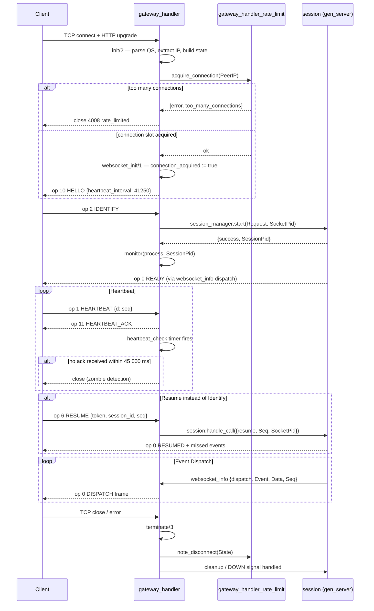

# WebSocket Handler

The WebSocket handler (`gateway_handler.erl`) is the Cowboy entry point for every client connection. It implements the `cowboy_websocket` behaviour and coordinates frame parsing, rate limiting, encoding, compression, and session lifecycle from TCP connect through disconnect.

See [session-lifecycle.md](session-lifecycle.md) for what happens once a Session is established, and [otp-supervision-tree.md](otp-supervision-tree.md) for where the Cowboy listener sits in the supervision tree.

---

## Connection Lifecycle



---

## Cowboy Behaviour Callbacks

### `init/2`

Called by Cowboy immediately after the HTTP upgrade. Parses the query string, extracts the client IP, initialises the handler state, and returns `{cowboy_websocket, Req, State}` to signal a WebSocket upgrade.

Query parameters parsed:

| Parameter  | Parser                              | Effect on state        |
|------------|-------------------------------------|------------------------|
| `v`        | `parse_version/1`                   | `version := 1 \| undefined` |
| `encoding` | `gateway_codec:parse_encoding/1`    | `encoding := json`     |
| `compress` | `gateway_compress:parse_compression/2` | `compress_ctx`      |
| `stream`   | `gateway_compress:parse_compression/2` | (passed alongside `compress`) |

`parse_version/1` accepts only `<<"1">>`. Any other value sets `version := undefined`, causing `websocket_init/1` to send close code 4012.

### `websocket_init/1`

Runs after the WebSocket handshake is confirmed. Two branches:

1. `version := 1` — calls `gateway_handler_rate_limit:acquire_connection/1` with `peer_ip`.
   - On `ok`: sets `connection_acquired := true`, reinitialises the compression context, starts the heartbeat timer, sends op 10 HELLO with `heartbeat_interval = 41 250`.
   - On `{error, too_many_connections}`: sends close code 4008 without setting `connection_acquired`.
2. Any other version: sends close code 4012 immediately.

The Hello payload is:

```json
{"op": 10, "d": {"heartbeat_interval": 41250}}
```

### `websocket_handle/2`

Routes incoming WebSocket frames. Accepts `{text, Binary}` and `{binary, Binary}`. Both paths call `handle_incoming_data/2`, which:

1. Checks `byte_size(Data) <= 4 096` (the value of `constants:max_payload_size/0`). Oversized frames close with 4002.
2. Decompresses with `gateway_compress:decompress/2`. Failure closes with 4002.
3. Decodes with `gateway_codec:decode/2`. Failure closes with 4002.
4. Extracts `<<"op">>` and maps it to an atom via `constants:gateway_opcode/1`.
5. Runs rate-limit checks via `gateway_handler_rate_limit:check_rate_limit/2`.
6. Dispatches to the correct opcode handler in `gateway_handler_dispatch`.

Any other frame type (ping, pong, etc.) is ignored: `{ok, State}`.

### `websocket_info/2`

Routes Erlang messages sent to the handler process. Key message patterns:

| Message pattern | Handler |
|---|---|
| `{heartbeat_check, Token}` | `gateway_handler_heartbeat:handle_heartbeat_check/2` |
| `{heartbeat_check}` (legacy) | `gateway_handler_heartbeat:handle_legacy_heartbeat_check/1` |
| `{dispatch, Event, Data, Seq}` | `gateway_handler_dispatch:handle_dispatch/4` |
| `{dispatch, Event, {pre_encoded, Bin}, Seq}` | `gateway_handler_dispatch:handle_dispatch/4` |
| `session_reconnect` | `gateway_handler_dispatch:handle_session_reconnect/1` |
| `{'DOWN', _, process, SessionPid, _}` | `gateway_handler_dispatch:handle_session_down/1` |
| `{'DOWN', Ref, process, Pid, Reason}` | `gateway_handler_dispatch:handle_request_worker_down/4` |
| `{gateway_request_worker_timeout, Ref, Type}` | `gateway_handler_dispatch:handle_request_worker_timeout/3` |
| `rollout_config_changed` | `gateway_handler_identify:handle_rollout_config_changed/1` |
| `{retry_pending_identify, Token}` | `gateway_handler_identify:handle_pending_identify_retry/2` |
| `retry_pending_identify` (legacy) | `gateway_handler_identify:handle_pending_identify_retry/1` |
| `{session_backpressure_error, _}` | ignored (`{ok, State}`) |
| `{process_voice_queue}` | `gateway_handler_voice:process_queued_voice_updates/1` |

### `terminate/3`

Called by Cowboy on disconnect regardless of the reason. Delegates to `terminate_with_state/1` when the state is a map:

1. Unsubscribes from rollout config change notifications.
2. Closes the compression context (`gateway_compress:close_context/1`).
3. Cancels the heartbeat timer.
4. Cleans up any pending request worker processes.
5. Cleans up the session reference via `gateway_handler_voice:cleanup_session/1`.
6. Calls `maybe_release_connection/1`, which calls `gateway_handler_rate_limit:note_disconnect/1` only if `connection_acquired := true`.

---

## Opcode Table

Opcodes are integers carried in the `"op"` field of every gateway payload. `constants:gateway_opcode/1` maps integers to atoms; `constants:opcode_to_num/1` is the reverse.

| Number | Atom | Direction |
|--------|------|-----------|
| 0 | `dispatch` | S→C |
| 1 | `heartbeat` | C→S |
| 2 | `identify` | C→S |
| 3 | `presence_update` | C→S |
| 4 | `voice_state_update` | C→S |
| 5 | `voice_server_ping` | C→S |
| 6 | `resume` | C→S |
| 7 | `reconnect` | S→C |
| 8 | `request_guild_members` | C→S |
| 9 | `invalid_session` | S→C |
| 10 | `hello` | S→C |
| 11 | `heartbeat_ack` | S→C |
| 12 | `gateway_error` | S→C |
| 14 | `lazy_request` | C→S |
| 15 | `request_guild_counts` | C→S |
| 16 | `request_channel_member_counts` | C→S |

Note: opcode 13 is not defined.

---

## Close Code Table

Close codes are sent as WebSocket close frames. `constants:close_code_to_num/1` maps atoms to their integer values.

| Code | Atom | Meaning |
|------|------|---------|
| 4000 | `unknown_error` | An unknown error occurred |
| 4001 | `unknown_opcode` | An unrecognised opcode was sent |
| 4002 | `decode_error` | Payload could not be decoded |
| 4003 | `not_authenticated` | A payload was sent before Identify |
| 4004 | `authentication_failed` | Token is invalid |
| 4005 | `already_authenticated` | Identify was sent more than once |
| 4007 | `invalid_seq` | An invalid sequence number was sent on Resume |
| 4008 | `rate_limited` | Too many connections or messages from this IP |
| 4009 | `session_timeout` | Session timed out while waiting to resume |
| 4010 | `invalid_shard` | Shard information sent on Identify was invalid |
| 4011 | `sharding_required` | Session would handle too many guilds; sharding is required |
| 4012 | `invalid_api_version` | `?v=` query parameter was not `1` |
| 4013 | `ack_backpressure` | Heartbeat acknowledgement backpressure limit reached |

Note: code 4006 is not defined.

---

## Encoding

`gateway_codec.erl` handles serialisation. Only `json` encoding is currently implemented.

`parse_encoding/1` accepts any value and always returns `json`. Frames are sent as `{text, Binary}`. Decoding uses `json:decode/1`; encoding uses `json:encode/1`.

The `encoding` query parameter is accepted for forward compatibility but has no effect on the chosen codec.

---

## Compression

`gateway_compress.erl` manages per-connection compression contexts.

Supported compression types:

| `compression()` atom | Query params | Notes |
|---|---|---|
| `none` | `compress=none` or omitted | No compression applied |
| `zstd_stream` | `compress=zstd-stream&stream=1` | Stateful per-connection zstd stream |

`parse_compression/2` takes the `compress` and `stream` query parameters separately. `zstd_stream` is only selected when `compress=zstd-stream` and `stream=1` (or `true`) are both present.

`new_context/1` returns an opaque `compress_ctx()` record. For `zstd_stream`, the stream context handle is initialised lazily on first use. `close_context/1` is called in `terminate/3`.

At `websocket_init/1`, the compression context is reinitialised fresh (`do_websocket_init/1` calls `gateway_compress:new_context/1` again) so the zstd stream starts clean after the handshake.

For incoming frames, `gateway_compress:decompress/2` is called before decoding. For outgoing frames, `gateway_compress:compress/2` is called after encoding. Both paths enforce the max decompressed size limit of 10 MiB (`?MAX_DECOMPRESSED_SIZE`).

---

## Rate Limiting

Rate limiting is enforced in two layers: per-IP connection counting and per-connection message/opcode budgets.

Rate limits can be disabled globally by setting the environment variable `FLUXER_DISABLE_RATE_LIMITS=1` (or `true`).

### Per-IP Connection Limit

`gateway_handler_rate_limit:acquire_connection/1` is called in `websocket_init/1`. It uses the ETS table `gateway_ip_connections` to track the live connection count per IP address.

The limit is **256 connections per IP** (`?MAX_CONNECTIONS_PER_IP`). If the count exceeds 256, `{error, too_many_connections}` is returned and the handler closes with code 4008. On success the counter is incremented atomically.

On disconnect, `note_disconnect/1` calls `release_connection/1`, which decrements the counter and deletes the ETS entry when the count reaches zero.

### Shared IP Rate Limit

`check_shared_ip_rate/1` applies a sliding-window bucket to the `gateway_shared_ip_rate` ETS table:

- Window: 60 000 ms
- Limit: 6 000 events per window

This check runs per incoming opcode across all connections from the same IP. Exceeding it returns `{error, ip_rate_limited}`, which maps to `{rate_limited, State}`.

### Shared User Rate Limit

`check_shared_user_rate/1` applies the same mechanism via `gateway_shared_user_rate`, keyed by `session_pid`:

- Window: 60 000 ms
- Limit: 600 events per window

### Per-Connection Message Budget

A per-connection sliding window tracks events in `rate_limit_state.events`:

- Window: 60 000 ms
- Limit: 600 events per window

Exceeding this budget returns `{rate_limited, State}`, which closes the connection with code 4008.

### Per-Opcode Rate Limit

After the connection budget passes, `check_opcode_rate_limit/3` applies opcode-specific limits tracked in `rate_limit_state.op_events`:

| Opcode | Window | Limit | Action on exceed |
|---|---|---|---|
| `presence_update` | 20 000 ms | 5 events | `{opcode_rate_limited, State}` (frame silently dropped) |

Opcode rate limiting returns `{opcode_rate_limited, State}`, which discards the frame without closing the connection.

---

## IP Extraction

`extract_client_ip/1` resolves the client IP as a binary string for use as the rate-limit key and for logging.

The header name is configurable via the `client_ip_header` environment variable (default: `x-forwarded-for`). The value is read at connection time via `fluxer_gateway_env:get(client_ip_header)`.

Extraction logic in `parse_forwarded_for/1`:

1. Splits the header value on `,` and takes the first entry.
2. Trims whitespace.
3. If the value starts with `[`, treats it as a bracketed IPv6 address: strips `[` and everything after `]`.
4. Otherwise, strips any trailing `:port` suffix to handle IPv4-with-port format.
5. Validates the result with `inet:parse_address/1`. Invalid values fall back to the Cowboy peer IP.

If the header is absent, `cowboy_req:peer/1` provides the remote address directly.

The extracted IP is stored in `state.peer_ip` as a binary and is used throughout the handler for rate limiting.

---

## `connection_acquired` Flag

The `connection_acquired` key in the handler state is an optional boolean. It is absent from the initial state returned by `new_state/0`.

It is set to `true` only when `gateway_handler_rate_limit:acquire_connection/1` returns `ok` in `websocket_init/1`.

In `terminate_with_state/1`, `maybe_release_connection/1` pattern-matches on `#{connection_acquired := true}`. This guard ensures `note_disconnect/1` is called exactly once, and only for connections that successfully acquired a slot. If the connection was rejected before acquiring a slot (e.g. wrong API version) the counter is never decremented.

---

## Identify Flow

`gateway_handler_identify:handle_identify/3` is called when the handler receives opcode 2.

Validation steps in order:

1. `session_abuse_protection:check_identify_rate/1` — per-IP identify rate check. Failure holds the Identify without closing.
2. `validate_identify_data/1` — extracts and validates `token`, `properties` (must contain `os`, `browser`, `device` as binaries), `shard` (optional), `initial_guild_id` (optional Snowflake), `ignored_events` (max 256 binary strings), `flags` (non-negative integer).
3. `gateway_sharding:parse_identify_shard/1` — validates shard tuple format. Failure closes with 4010.

On success, `start_session/3` is called:

1. Checks `gateway_rollout_config:session_rollout_percentage()`. If `<= 0`, holds the Identify.
2. Checks `gateway_node_router:is_draining()`. If draining, holds the Identify.
3. Calls `session_manager:start(Request, SocketPid)`.
4. On `{success, Pid}`: monitors the session process and stores `session_pid` in state.

If the node is draining or the rollout percentage is zero, the identify is held in `state.pending_identify` and retried on `rollout_config_changed` or `retry_pending_identify` messages. Retry jitter is `1 000 ms base + up to 1 000 ms random`.

Error handling maps session start errors to specific close codes or reconnect signals. See `session_start_error_action/1` for the full mapping.

---

## Resume Flow

`gateway_handler_identify:handle_resume/2` delegates to `gateway_handler_resume:handle_resume/2`. The resume payload must contain `token`, `session_id`, and `seq`. See [session-lifecycle.md](session-lifecycle.md) for the full session-side resume logic.
